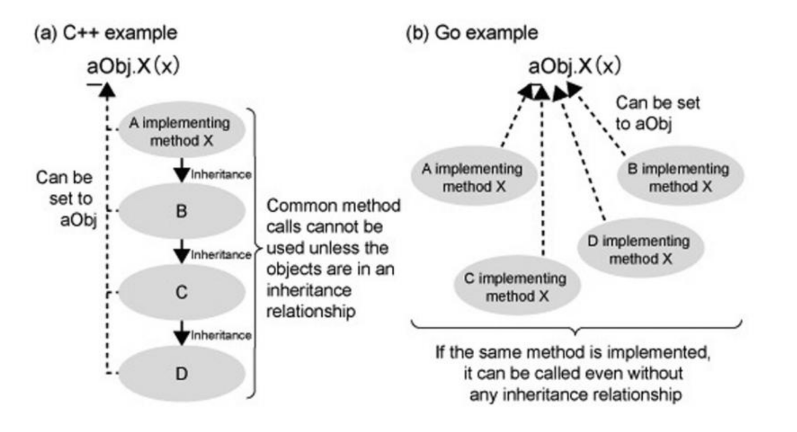
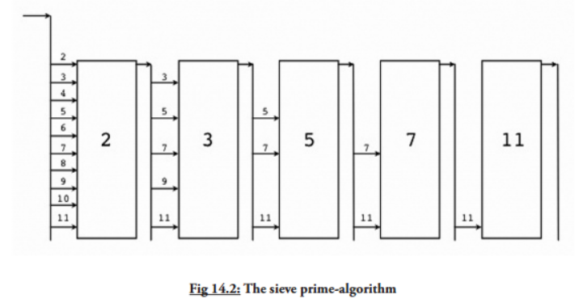

[toc]
### 1.语言特性
#### 1.1早期影响
    在声明和包的设计方面，Go 语言受到 Pascal、Modula 和 Oberon 系语言的影响；在并发原理的设计上，Go 语言从同样受到 Tony Hoare 的 CSP（通信序列进程 Communicating Sequential Processes）理论影响的 Limbo 和 Newsqueak 的实践中借鉴了一些经验，并使用了和 Erlang 类似的机制。
#### 1.2 指导设计原则
    Go语言通过减少关键字的数量（25 个）来简化编码过程中的混乱和复杂度。干净、整齐和简洁的语法也能够提高程序的编译速度，因为这些关键字在编译过程中少到甚至不需要符号表来协助解析。

    这些方面的工作都是为了减少编码的工作量，甚至可以与 Java 的简化程度相比较。

    Go 语言有一种极简抽象艺术家的感觉，因为它只提供了一到两种方法来解决某个问题，这使得开发者们的代码都非常容易阅读和理解。众所周知，代码的可读性是软件工程里最重要的一部分（ 译者注：代码是写给人看的，不是写给机器看的 ）。

    这些设计理念没有建立其它概念之上，所以并不会因为牵扯到一些概念而将某个概念复杂化，他们之间是相互独立的。

    Go 语言有一套完整的编码规范，你可以在 Go 语言编码规范 页面进行查看。

    它不像 Ruby 那样通过实现过程来定义编码规范。作为一门具有明确编码规范的语言，它要求可以采用不同的编译器如 gc 和 gccgo（第 2.1 节）进行编译工作，这对语言本身拥有更好的编码规范起到很大帮助。

    LALR 是 Go 语言的语法标准，你也可以在 src/cmd/internal/gc/go.y 中查看到，这种语法标准在编译时不需要符号表来协助解析。

#### 1.3语言的特性
    Go 语言从本质上（程序和结构方面）来实现并发编程。

    因为 Go 语言没有类和继承的概念，所以它和 Java 或 C++ 看起来并不相同。但是它通过接口（interface）的概念来实现多态性。Go 语言有一个清晰易懂的轻量级类型系统，在类型之间也没有层级之说。因此可以说这是一门混合型的语言。

    在传统的面向对象语言中，使用面向对象编程技术显得非常臃肿，它们总是通过复杂的模式来构建庞大的类型层级，这违背了编程语言应该提升生产力的宗旨。

#### 1.4关于特性缺失
    为了简化设计，不支持函数重载和操作符重载
    为了避免在 C/C++ 开发中的一些 Bug 和混乱，不支持隐式转换
    Go 语言通过另一种途径实现面向对象设计（第 10-11 章）来放弃类和类型的继承
    尽管在接口的使用方面（第 11 章）可以实现类似变体类型的功能，但本身不支持变体类型
    不支持动态加载代码
    不支持动态链接库
    不支持泛型
    通过 recover 和 panic 来替代异常机制（第 13.2-3 节）
    不支持静态变量

### 2.2 Go 环境变量

    $GOROOT 表示 Go 在你的电脑上的安装位置，它的值一般都是 $HOME/go，当然，你也可以安装在别的地方。
    $GOARCH 表示目标机器的处理器架构，它的值可以是 386、amd64 或 arm。
    $GOOS 表示目标机器的操作系统，它的值可以是 darwin、freebsd、linux 或 windows。
    $GOBIN 表示编译器和链接器的安装位置，默认是 $GOROOT/bin，如果你使用的是 Go 1.0.3 及以后的版本，一般情况下你可以将它的值设置为空，Go 将会使用前面提到的默认值。
    $GOPATH 默认采用和 $GOROOT 一样的值，但从 Go 1.1 版本开始，你必须修改为其它路径。它可以包含多个 Go 语言源码文件、包文件和可执行文件的路径，而这些路径下又必须分别包含三个规定的目录：src、pkg 和 bin，这三个目录分别用于存放源码文件、包文件和可执行文件。
    $GOARM 专门针对基于 arm 架构的处理器，它的值可以是 5 或 6，默认为 6。
    $GOMAXPROCS 用于设置应用程序可使用的处理器个数与核数，详见第 14.1.3 节。


### 2.6 安装目录清单

    /bin：包含可执行文件，如：编译器，Go 工具
    /doc：包含示例程序，代码工具，本地文档等
    /lib：包含文档模版
    /misc：包含与支持 Go 编辑器有关的配置文件以及 cgo 的示例
    /os_arch：包含标准库的包的对象文件（.a）
    /src：包含源代码构建脚本和标准库的包的完整源代码（Go 是一门开源语言）
    /src/cmd：包含 Go 和 C 的编译器和命令行脚本


### 2.7 Go 运行时（runtime）

    尽管 Go 编译器产生的是本地可执行代码，这些代码仍旧运行在 Go 的 runtime（这部分的代码可以在 runtime 包中找到）当中。这个 runtime 类似 Java 和 .NET 语言所用到的虚拟机，它负责管理包括内存分配、垃圾回收（第 10.8 节）、栈处理、goroutine、channel、切片（slice）、map 和反射（reflection）等等。

    垃圾回收器 Go 拥有简单却高效的标记-清除回收器。它的主要思想来源于 IBM 的可复用垃圾回收器，旨在打造一个高效、低延迟的并发回收器。目前 gccgo 还没有回收器，同时适用 gc 和 gccgo 的新回收器正在研发中。使用一门具有垃圾回收功能的编程语言不代表你可以避免内存分配所带来的问题，分配和回收内容都是消耗 CPU 资源的一种行为。


### 4.1 文件名、关键字与标识符
    Go 的源文件以 .go 为后缀名存储在计算机中，这些文件名均由小写字母组成，如 scanner.go 。如果文件名由多个部分组成，则使用下划线 _ 对它们进行分隔，如 scanner_test.go 。文件名不包含空格或其他特殊字符。


    break	default	func	interface	select
    case	defer	go	map	struct
    chan	else	goto	package	switch
    const	fallthrough	if	range	type
    continue	for	import	return	var

    之所以刻意地将 Go 代码中的关键字保持的这么少，是为了简化在编译过程第一步中的代码解析。和其它语言一样，关键字不能够作标识符使用。


    除了以上介绍的这些关键字，Go 语言还有 36 个预定义标识符，其中包含了基本类型的名称和一些基本的内置函数（第 6.5 节），它们的作用都将在接下来的章节中进行进一步地讲解。

    append	bool	byte	cap	close	complex	complex64	complex128	uint16
    copy	false	float32	float64	imag	int	int8	int16	uint32
    int32	int64	iota	len	make	new	nil	panic	uint64
    print	println	real	recover	string	true	uint	uint8	uintptr


### 4.2 Go 程序的基本结构和要素

```
package main

import "fmt"

func main() {
	fmt.Println("hello, world")
}
```


    包是结构化代码的一种方式：每个程序都由包（通常简称为 pkg）的概念组成，可以使用自身的包或者从其它包中导入内容。

    如同其它一些编程语言中的类库或命名空间的概念，每个 Go 文件都属于且仅属于一个包。一个包可以由许多以 .go 为扩展名的源文件组成，因此文件名和包名一般来说都是不相同的。

    你必须在源文件中非注释的第一行指明这个文件属于哪个包，如：package main。package main表示一个可独立执行的程序，每个 Go 应用程序都包含一个名为 main 的包。

    一个应用程序可以包含不同的包，而且即使你只使用 main 包也不必把所有的代码都写在一个巨大的文件里：你可以用一些较小的文件，并且在每个文件非注释的第一行都使用 package main 来指明这些文件都属于 main 包。如果你打算编译包名不是为 main 的源文件，如 pack1，编译后产生的对象文件将会是 pack1.a 而不是可执行程序。

#### 4.2.2 函数

    你可以在括号 () 中写入 0 个或多个函数的参数（使用逗号 , 分隔），每个参数的名称后面必须紧跟着该参数的类型。

    main 函数是每一个可执行程序所必须包含的，一般来说都是在启动后第一个执行的函数（如果有 init() 函数则会先执行该函数）。如果你的 main 包的源代码没有包含 main 函数，则会引发构建错误 undefined: main.main。main 函数既没有参数，也没有返回类型（与 C 家族中的其它语言恰好相反）。如果你不小心为 main 函数添加了参数或者返回类型，将会引发构建错误：
```
    func functionName(parameter_list) (return_value_list) {
    …
    }
```
    parameter_list 的形式为 (param1 type1, param2 type2, …)
    return_value_list 的形式为 (ret1 type1, ret2 type2, …)


#### 4.2.4 类型

    类型可以是基本类型，如：int、float、bool、string；结构化的（复合的），如：struct、array、slice、map、channel；只描述类型的行为的，如：interface。


#### 4.2.5 Go 程序的一般结构

    下面的程序可以被顺利编译但什么都做不了，不过这很好地展示了一个 Go 程序的首选结构。这种结构并没有被强制要求，编译器也不关心 main 函数在前还是变量的声明在前，但使用统一的结构能够在从上至下阅读 Go 代码时有更好的体验。

    所有的结构将在这一章或接下来的章节中进一步地解释说明，但总体思路如下：

    在完成包的 import 之后，开始对常量、变量和类型的定义或声明。
    如果存在 init 函数的话，则对该函数进行定义（这是一个特殊的函数，每个含有该函数的包都会首先执行这个函数）。
    如果当前包是 main 包，则定义 main 函数。
    然后定义其余的函数，首先是类型的方法，接着是按照 main 函数中先后调用的顺序来定义相关函数，如果有很多函数，则可以按照字母顺序来进行排序。

```
    package main

    import (
    "fmt"
    )

    const c = "C"

    var v int = 5

    type T struct{}

    func init() { // initialization of package
    }

    func main() {
    var a int
    Func1()
    // ...
    fmt.Println(a)
    }

    func (t T) Method1() {
    //...
    }

    func Func1() { // exported function Func1
    //...
    }
```

    Go 程序的执行（程序启动）顺序如下：

    按顺序导入所有被 main 包引用的其它包，然后在每个包中执行如下流程：
    如果该包又导入了其它的包，则从第一步开始递归执行，但是每个包只会被导入一次。
    然后以相反的顺序在每个包中初始化常量和变量，如果该包含有 init 函数的话，则调用该函数。
    在完成这一切之后，main 也执行同样的过程，最后调用 main 函数开始执行程序。


#### 4.2.6 类型转换
    在必要以及可行的情况下，一个类型的值可以被转换成另一种类型的值。由于 Go 语言不存在隐式类型转换，因此所有的转换都必须显式说明，就像调用一个函数一样（类型在这里的作用可以看作是一种函数）：


#### Go 命名规范

    干净、可读的代码和简洁性是 Go 追求的主要目标。通过 gofmt 来强制实现统一的代码风格。Go 语言中对象的命名也应该是简洁且有意义的。像 Java 和 Python 中那样使用混合着大小写和下划线的冗长的名称会严重降低代码的可读性。名称不需要指出自己所属的包，因为在调用的时候会使用包名作为限定符。返回某个对象的函数或方法的名称一般都是使用名词，没有 Get... 之类的字符，如果是用于修改某个对象，则使用 SetName。有必须要的话可以使用大小写混合的方式，如 MixedCaps 或 mixedCaps，而不是使用下划线来分割多个名称。

### 4.3 常量

    常量使用关键字 const 定义，用于存储不会改变的数据。

    存储在常量中的数据类型只可以是布尔型、数字型（整数型、浮点型和复数）和字符串型。

    常量的定义格式：const identifier [type] = value，例如：

    const Pi = 3.14159
    在 Go 语言中，你可以省略类型说明符 [type]，因为编译器可以根据变量的值来推断其类型。

    显式类型定义： const b string = "abc"
    隐式类型定义： const b = "abc"
    一个没有指定类型的常量被使用时，会根据其使用环境而推断出它所需要具备的类型。换句话说，未定义类型的常量会在必要时刻根据上下文来获得相关类型。

    var n int
    f(n + 5) // 无类型的数字型常量 “5” 它的类型在这里变成了 int
    常量的值必须是能够在编译时就能够确定的；你可以在其赋值表达式中涉及计算过程，但是所有用于计算的值必须在编译期间就能获得。

    正确的做法：const c1 = 2/3
    错误的做法：const c2 = getNumber() // 引发构建错误: getNumber() used as value
    因为在编译期间自定义函数均属于未知，因此无法用于常量的赋值，但内置函数可以使用，如：len()。

    数字型的常量是没有大小和符号的，并且可以使用任何精度而不会导致溢出：
```
    // 赋值两个常量，iota 只会增长一次，而不会因为使用了两次就增长两次
    const (
        Apple, Banana = iota + 1, iota + 2 // Apple=1 Banana=2
        Cherimoya, Durian                  // Cherimoya=2 Durian=3
        Elderberry, Fig                    // Elderberry=3, Fig=4

    )
```

    iota 也可以用在表达式中，如：iota + 50。在每遇到一个新的常量块或单个常量声明时， iota 都会重置为 0（ 简单地讲，每遇到一次 const 关键字，iota 就重置为 0 ）。

    当然，常量之所以为常量就是恒定不变的量，因此我们无法在程序运行过程中修改它的值；如果你在代码中试图修改常量的值则会引发编译错误。


### 4.4 变量
#### 4.4.1 简介

    声明变量的一般形式是使用 var 关键字：var identifier type。

    需要注意的是，Go 和许多编程语言不同，它在声明变量时将变量的类型放在变量的名称之后。Go 为什么要选择这么做呢？

    首先，它是为了避免像 C 语言中那样含糊不清的声明形式，例如：int* a, b;。在这个例子中，只有 a 是指针而 b 不是。如果你想要这两个变量都是指针，则需要将它们分开书写（你可以在 Go 语言的声明语法 页面找到有关于这个话题的更多讨论）。

    而在 Go 中，则可以很轻松地将它们都声明为指针类型：

    var a, b *int
    其次，这种语法能够按照从左至右的顺序阅读，使得代码更加容易理解。

    示例：

    var a int
    var b bool
    var str string
    你也可以改写成这种形式：

    var (
        a int
        b bool
        str string
    )
    这种因式分解关键字的写法一般用于声明全局变量。

    当一个变量被声明之后，系统自动赋予它该类型的零值：int 为 0，float 为 0.0，bool 为 false，string 为空字符串，指针为 nil。记住，所有的内存在 Go 中都是经过初始化的。


    但是 Go 编译器的智商已经高到可以根据变量的值来自动推断其类型，这有点像 Ruby 和 Python 这类动态语言，只不过它们是在运行时进行推断，而 Go 是在编译时就已经完成推断过程。因此，你还可以使用下面的这些形式来声明及初始化变量：


#### 4.4.2 值类型和引用类型
[https://blog.csdn.net/love666666shen/article/details/99882528]
#### 4.4.4 简短形式，使用 := 赋值操作符
    我们知道可以在变量的初始化时省略变量的类型而由系统自动推断，而这个时候再在 Example 4.4.1 的最后一个声明语句写上 var 关键字就显得有些多余了，因此我们可以将它们简写为 a := 50 或 b := false。

    a 和 b 的类型（int 和 bool）将由编译器自动推断。

    这是使用变量的首选形式，但是它只能被用在函数体内，而不可以用于全局变量的声明与赋值。使用操作符 := 可以高效地创建一个新的变量，称之为初始化声明。

    (这是将类型写在标识符后面的一个重要原因)

    多变量可以在同一行进行赋值，如：

    a, b, c = 5, 7, "abc"
    上面这行假设了变量 a，b 和 c 都已经被声明，否则的话应该这样使用：

    a, b, c := 5, 7, "abc"
    右边的这些值以相同的顺序赋值给左边的变量，所以 a 的值是 5， b 的值是 7，c 的值是 "abc"。

    这被称为 并行 或 同时 赋值。

    如果你想要交换两个变量的值，则可以简单地使用 a, b = b, a。

#### 4.4.5 init 函数

    变量除了可以在全局声明中初始化，也可以在 init 函数中初始化。这是一类非常特殊的函数，它不能够被人为调用，而是在每个包完成初始化后自动执行，并且执行优先级比 main 函数高。

    每个源文件都只能包含一个 init 函数。初始化总是以单线程执行，并且按照包的依赖关系顺序执行。

    一个可能的用途是在开始执行程序之前对数据进行检验或修复，以保证程序状态的正确性。


### 4.5基本类型&运算符
#### 4.5.1 布尔类型 bool

    Go 对于值之间的比较有非常严格的限制，只有两个类型相同的值才可以进行比较，如果值的类型是接口（interface，第 11 章），它们也必须都实现了相同的接口。如果其中一个值是常量，那么另外一个值的类型必须和该常量类型相兼容的。如果以上条件都不满足，则其中一个值的类型必须在被转换为和另外一个值的类型相同之后才可以进行比较。

    布尔型的常量和变量也可以通过和逻辑运算符（非 !、和 &&、或 ||）结合来产生另外一个布尔值，这样的逻辑语句就其本身而言，并不是一个完整的 Go 语句。

    逻辑值可以被用于条件结构中的条件语句（第 5 章），以便测试某个条件是否满足。另外，和 &&、或 || 与相等 == 或不等 != 属于二元运算符，而非 ! 属于一元运算符。

#### 4.5.2 数字类型
##### 4.5.2.1 整型 int 和浮点型 float
    Go 语言支持整型和浮点型数字，并且原生支持复数，其中位的运算采用补码（详情参见 二的补码 页面）。

    Go 也有基于架构的类型，例如：int、uint 和 uintptr。

    这些类型的长度都是根据运行程序所在的操作系统类型所决定的：

    int 和 uint 在 32 位操作系统上，它们均使用 32 位（4 个字节），在 64 位操作系统上，它们均使用 64 位（8 个字节）。
    uintptr 的长度被设定为足够存放一个指针即可。
    Go 语言中没有 float 类型。（Go语言中只有 float32 和 float64）没有double类型。

    与操作系统架构无关的类型都有固定的大小，并在类型的名称中就可以看出来：

    整数：

    int8（-128 -> 127）
    int16（-32768 -> 32767）
    int32（-2,147,483,648 -> 2,147,483,647）
    int64（-9,223,372,036,854,775,808 -> 9,223,372,036,854,775,807）
    无符号整数：

    uint8（0 -> 255）
    uint16（0 -> 65,535）
    uint32（0 -> 4,294,967,295）
    uint64（0 -> 18,446,744,073,709,551,615）
    浮点型（IEEE-754 标准）：

    float32（+- 1e-45 -> +- 3.4 * 1e38）
    float64（+- 5 * 1e-324 -> 107 * 1e308）
    int 型是计算最快的一种类型。

    整型的零值为 0，浮点型的零值为 0.0。

    float32 精确到小数点后 7 位，float64 精确到小数点后 15 位。由于精确度的缘故，你在使用 == 或者 != 来比较浮点数时应当非常小心。你最好在正式使用前测试对于精确度要求较高的运算。

    你应该尽可能地使用 float64，因为 math 包中所有有关数学运算的函数都会要求接收这个类型。

    你可以通过增加前缀 0 来表示 8 进制数（如：077），增加前缀 0x 来表示 16 进制数（如：0xFF），以及使用 e 来表示 10 的连乘（如： 1e3 = 1000，或者 6.022e23 = 6.022 x 1e23）。

    你可以使用 a := uint64(0) 来同时完成类型转换和赋值操作，这样 a 的类型就是 uint64。

    Go 中不允许不同类型之间的混合使用，但是对于常量的类型限制非常少，因此允许常量之间的混合使用，下面这个程序很好地解释了这个现象（该程序无法通过编译）：

##### 4.5.2.3 位运算
    位运算只能用于整数类型的变量，且需当它们拥有等长位模式时。

    %b 是用于表示位的格式化标识符。

    二元运算符

    按位与 &：

    对应位置上的值经过和运算结果，具体参见和运算符，第 4.5.1 节，并将 T（true）替换为 1，将 F（false）替换为 0

    1 & 1 -> 1
    1 & 0 -> 0
    0 & 1 -> 0
    0 & 0 -> 0
    按位或 |：

    对应位置上的值经过或运算结果，具体参见或运算符，第 4.5.1 节，并将 T（true）替换为 1，将 F（false）替换为 0

    1 | 1 -> 1
    1 | 0 -> 1
    0 | 1 -> 1
    0 | 0 -> 0
    按位异或 ^：

    对应位置上的值根据以下规则组合：

    1 ^ 1 -> 0
    1 ^ 0 -> 1
    0 ^ 1 -> 1
    0 ^ 0 -> 0
    位清除 &^：将指定位置上的值设置为 0。

    一元运算符

    按位补足 ^：

    该运算符与异或运算符一同使用，即 m^x，对于无符号 x 使用“全部位设置为 1”，对于有符号 x 时使用 m=-1。例如：

    ^10 = -01 ^ 10 = -11
    位左移 <<：

    用法：bitP << n。

    bitP 的位向左移动 n 位，右侧空白部分使用 0 填充；如果 n 等于 2，则结果是 2 的相应倍数，即 2 的 n 次方。例如：

    1 << 10 // 等于 1 KB
    1 << 20 // 等于 1 MB
    1 << 30 // 等于 1 GB
    位右移 >>：

    用法：bitP >> n。
    bitP 的位向右移动 n 位，左侧空白部分使用 0 填充；如果 n 等于 2，则结果是当前值除以 2 的 n 次方。
    当希望把结果赋值给第一个操作数时，可以简写为 a <<= 2 或者 b ^= a & 0xffffffff。

    位左移常见实现存储单位的用例

    使用位左移与 iota 计数配合可优雅地实现存储单位的常量枚举：


##### 4.5.2.4 逻辑运算符
    Go 中拥有以下逻辑运算符：==、!=（第 4.5.1 节）、<、<=、>、>=。

    它们之所以被称为逻辑运算符是因为它们的运算结果总是为布尔值 bool。例如：

    b3 := 10 > 5 // b3 is true

##### 4.5.2.5 算术运算符
    常见可用于整数和浮点数的二元运算符有 +、-、* 和 /。

    （相对于一般规则而言，Go 在进行字符串拼接时允许使用对运算符 + 的重载，但 Go 本身不允许开发者进行自定义的运算符重载）

    / 对于整数运算而言，结果依旧为整数，例如：9 / 4 -> 2。

    取余运算符只能作用于整数：9 % 4 -> 1。

    整数除以 0 可能导致程序崩溃，将会导致运行时的恐慌状态（如果除以 0 的行为在编译时就能被捕捉到，则会引发编译错误）；第 13 章将会详细讲解如何正确地处理此类情况。

    浮点数除以 0.0 会返回一个无穷尽的结果，使用 +Inf 表示。

    练习 4.4 尝试编译 divby0.go。

    你可以将语句 b = b + a 简写为 b+=a，同样的写法也可用于 -=、*=、/=、%=。

    对于整数和浮点数，你可以使用一元运算符 ++（递增）和 --（递减），但只能用于后缀：

    i++ -> i += 1 -> i = i + 1
    i-- -> i -= 1 -> i = i - 1
    同时，带有 ++ 和 -- 的只能作为语句，而非表达式，因此 n = i++ 这种写法是无效的，其它像 f(i++) 或者 a[i]=b[i++] 这些可以用于 C、C++ 和 Java 中的写法在 Go 中也是不允许的。

    在运算时 溢出 不会产生错误，Go 会简单地将超出位数抛弃。如果你需要范围无限大的整数或者有理数（意味着只被限制于计算机内存），你可以使用标准库中的 big 包，该包提供了类似 big.Int 和 big.Rat 这样的类型（第 9.4 节）。

##### 4.5.3 运算符与优先级
    有些运算符拥有较高的优先级，二元运算符的运算方向均是从左至右。下表列出了所有运算符以及它们的优先级，由上至下代表优先级由高到低：

    优先级 	运算符
    7 		^ !
    6 		* / % << >> & &^
    5 		+ - | ^
    4 		== != < <= >= >
    3 		<-
    2 		&&
    1 		||
    当然，你可以通过使用括号来临时提升某个表达式的整体运算优先级。

##### 4.5.4 类型别名
    当你在使用某个类型时，你可以给它起另一个名字，然后你就可以在你的代码中使用新的名字（用于简化名称或解决名称冲突）。

    在 type TZ int 中，TZ 就是 int 类型的新名称（用于表示程序中的时区），然后就可以使用 TZ 来操作 int 类型的数据。

    示例 4.11 type.go

    package main
    import "fmt"

    type TZ int

    func main() {
        var a, b TZ = 3, 4
        c := a + b
        fmt.Printf("c has the value: %d", c) // 输出：c has the value: 7
    }
    实际上，类型别名得到的新类型并非和原类型完全相同，新类型不会拥有原类型所附带的方法（第 10 章）；TZ 可以自定义一个方法用来输出更加人性化的时区信息。

##### 4.5.5 字符类型
    严格来说，这并不是 Go 语言的一个类型，字符只是整数的特殊用例。byte 类型是 uint8 的别名，对于只占用 1 个字节的传统 ASCII 编码的字符来说，完全没有问题。例如：var ch byte = 'A'；字符使用单引号括起来。

    在 ASCII 码表中，A 的值是 65，而使用 16 进制表示则为 41，所以下面的写法是等效的：

    var ch byte = 65 或 var ch byte = '\x41'
    （\x 总是紧跟着长度为 2 的 16 进制数）

    另外一种可能的写法是 \ 后面紧跟着长度为 3 的 8 进制数，例如：\377。

    不过 Go 同样支持 Unicode（UTF-8），因此字符同样称为 Unicode 代码点或者 runes，并在内存中使用 int 来表示。在文档中，一般使用格式 U+hhhh 来表示，其中 h 表示一个 16 进制数。其实 rune 也是 Go 当中的一个类型，并且是 int32 的别名。

    在书写 Unicode 字符时，需要在 16 进制数之前加上前缀 \u 或者 \U。

    因为 Unicode 至少占用 2 个字节，所以我们使用 int16 或者 int 类型来表示。如果需要使用到 4 字节，则会加上 \U 前缀；前缀 \u 则总是紧跟着长度为 4 的 16 进制数，前缀 \U 紧跟着长度为 8 的 16 进制数。

    示例 4.12 char.go

    var ch int = '\u0041'
    var ch2 int = '\u03B2'
    var ch3 int = '\U00101234'
    fmt.Printf("%d - %d - %d\n", ch, ch2, ch3) // integer
    fmt.Printf("%c - %c - %c\n", ch, ch2, ch3) // character
    fmt.Printf("%X - %X - %X\n", ch, ch2, ch3) // UTF-8 bytes
    fmt.Printf("%U - %U - %U", ch, ch2, ch3) // UTF-8 code point
    输出：

    65 - 946 - 1053236
    A - β - r
    41 - 3B2 - 101234
    U+0041 - U+03B2 - U+101234
    格式化说明符 %c 用于表示字符；当和字符配合使用时，%v 或 %d 会输出用于表示该字符的整数；%U 输出格式为 U+hhhh 的字符串（另一个示例见第 5.4.4 节）。

    包 unicode 包含了一些针对测试字符的非常有用的函数（其中 ch 代表字符）：

    判断是否为字母：unicode.IsLetter(ch)
    判断是否为数字：unicode.IsDigit(ch)
    判断是否为空白符号：unicode.IsSpace(ch)
    这些函数返回一个布尔值。包 utf8 拥有更多与 rune 类型相关的函数。

### 4.6 字符串

    字符串是 UTF-8 字符的一个序列（当字符为 ASCII 码时则占用 1 个字节，其它字符根据需要占用 2-4 个字节）。UTF-8 是被广泛使用的编码格式，是文本文件的标准编码，其它包括 XML 和 JSON 在内，也都使用该编码。由于该编码对占用字节长度的不定性，Go 中的字符串里面的字符也可能根据需要占用 1 至 4 个字节（示例见第 4.6 节），这与其它语言如 C++、Java 或者 Python 不同（Java 始终使用 2 个字节）。Go 这样做的好处是不仅减少了内存和硬盘空间占用，同时也不用像其它语言那样需要对使用 UTF-8 字符集的文本进行编码和解码。

    字符串是一种值类型，且值不可变，即创建某个文本后你无法再次修改这个文本的内容；更深入地讲，字符串是字节的定长数组。

    Go 支持以下 2 种形式的字面值：

        解释字符串：

        该类字符串使用双引号括起来，其中的相关的转义字符将被替换，这些转义字符包括：

        \n：换行符
        \r：回车符
        \t：tab 键
        \u 或 \U：Unicode 字符
        \\：反斜杠自身
        非解释字符串：

        该类字符串使用反引号括起来，支持换行，例如：

        `This is a raw string \n` 中的 `\n\` 会被原样输出。
    
    一般的比较运算符（==、!=、<、<=、>=、>）通过在内存中按字节比较来实现字符串的对比。你可以通过函数 len() 来获取字符串所占的字节长度，例如：len(str)。

    字符串的内容（纯字节）可以通过标准索引法来获取，在中括号 [] 内写入索引，索引从 0 开始计数：

    字符串 str 的第 1 个字节：str[0]
    第 i 个字节：str[i - 1]
    最后 1 个字节：str[len(str)-1]
    需要注意的是，这种转换方案只对纯 ASCII 码的字符串有效。

### 4.7 string包
    strconv  转化包
    strings  工具包

### 4.8 Time
### 4.9 指针

    不像 Java 和 .NET，Go 语言为程序员提供了控制数据结构的指针的能力；但是，你不能进行指针运算。通过给予程序员基本内存布局，Go 语言允许你控制特定集合的数据结构、分配的数量以及内存访问模式，这些对构建运行良好的系统是非常重要的：指针对于性能的影响是不言而喻的，而如果你想要做的是系统编程、操作系统或者网络应用，指针更是不可或缺的一部分。

    程序在内存中存储它的值，每个内存块（或字）有一个地址，通常用十六进制数表示，如：0x6b0820 或 0xf84001d7f0。

    Go 语言的取地址符是 &，放到一个变量前使用就会返回相应变量的内存地址。

    一个指针变量可以指向任何一个值的内存地址 它指向那个值的内存地址，在 32 位机器上占用 4 个字节，在 64 位机器上占用 8 个字节，并且与它所指向的值的大小无关。当然，可以声明指针指向任何类型的值来表明它的原始性或结构性；你可以在指针类型前面加上 * 号（前缀）来获取指针所指向的内容，这里的 * 号是一个类型更改器。使用一个指针引用一个值被称为间接引用。

    当一个指针被定义后没有分配到任何变量时，它的值为 nil。

    一个指针变量通常缩写为 ptr (pointer)


#### 4.9.1 注意事项
-   不能获取字面量与常量的地址

    但是对于经常导致 C 语言内存泄漏继而程序崩溃的指针运算（所谓的指针算法，如：pointer+2，移动指针指向字符串的字节数或数组的某个位置）是不被允许的。Go 语言中的指针保证了内存安全，更像是 Java、C# 和 VB.NET 中的引用。


    因此 c = *p++ 在 Go 语言的代码中是不合法的。


    指针的一个高级应用是你可以传递一个变量的引用（如函数的参数），这样不会传递变量的拷贝。指针传递是很廉价的，只占用 4 个或 8 个字节。当程序在工作中需要占用大量的内存，或很多变量，或者两者都有，使用指针会减少内存占用和提高效率。被指向的变量也保存在内存中，直到没有任何指针指向它们，所以从它们被创建开始就具有相互独立的生命周期。


- 对一个空指针的反向引用是不合法的，并且会使程序崩溃：
eg:

```
    package main
    func main(){
        var p *int = nil
        *p = 0
    }
```


### 5.0控制结构

-   if-else 
-   switch
-   select channel
-   for(range)


#### 5.1 if-else

-   
```if 可以包含一个初始化语句（如：给一个变量赋值）。这种写法具有固定的格式（在初始化语句后方必须加上分号）
if initialization; condition {
	// do something
}


case 2:
if condition {
    //do something
}

```
#### 5.2 多返回值函数的错误

    Go 语言的函数经常使用两个返回值来表示执行是否成功：返回某个值以及 true 表示成功；返回零值（或 nil）和 false 表示失败（第 4.4 节）。当不使用 true 或 false 的时候，也可以使用一个 error 类型的变量来代替作为第二个返回值：成功执行的话，error 的值为 nil，否则就会包含相应的错误信息（Go 语言中的错误类型为 error: var err error，我们将会在第 13 章进行更多地讨论）。这样一来，就很明显需要用一个 if 语句来测试执行结果；由于其符号的原因，这样的形式又称之为 comma,ok 模式（pattern）。

习惯用法
```
    value, err := pack1.Function1(param1)
    if err != nil {
        fmt.Printf("An error occured in pack1.Function1 with parameter %v", param1)
        return err
    }
    // 未发生错误，继续执行：

    if value, ok := readData(); ok {
    …
    }
```

### 5.3 switch 结构

    相比较 C 和 Java 等其它语言而言，Go 语言中的 switch 结构使用上更加灵活。它接受任意形式的表达式：

    switch var1 {
        case val1:
            ...
        case val2:
            ...
        default:
            ...
    }
    变量 var1 可以是任何类型，而 val1 和 val2 则可以是同类型的任意值。类型不被局限于常量或整数，但必须是相同的类型；或者最终结果为相同类型的表达式。前花括号 { 必须和 switch 关键字在同一行。

    您可以同时测试多个可能符合条件的值，使用逗号分割它们，例如：case val1, val2, val3。

    每一个 case 分支都是唯一的，从上至下逐一测试，直到匹配为止。（ Go 语言使用快速的查找算法来测试 switch 条件与 case 分支的匹配情况，直到算法匹配到某个 case 或者进入 default 条件为止。）

    一旦成功地匹配到某个分支，在执行完相应代码后就会退出整个 switch 代码块，也就是说您不需要特别使用 break 语句来表示结束。

    因此，程序也不会自动地去执行下一个分支的代码。如果在执行完每个分支的代码后，还希望继续执行后续分支的代码，可以使用 fallthrough 关键字来达到目的。


    switch i {
        case 0: fallthrough
        case 1:
            f() // 当 i == 0 时函数也会被调用
    }


        switch initialization {
        case val1:
            ...
        case val2:
            ...
        default:
            ...
    }

### 5.4  for 结构

#### base
```
    func main() {
        for i := 0; i < 5; i++ {
            fmt.Printf("This is the %d iteration\n", i)
        }
    }
```
#### 5.4.2 基于条件判断的迭代
    

    for 结构的第二种形式是没有头部的条件判断迭代（类似其它语言中的 while 循环），基本形式为：for 条件语句 {}。

    您也可以认为这是没有初始化语句和修饰语句的 for 结构，因此 ;; 便是多余的了。

#### 5.4.3 无限循环


    条件语句是可以被省略的，如 i:=0; ; i++ 或 for { } 或 for ;; { }（;; 会在使用 gofmt 时被移除）：这些循环的本质就是无限循环。最后一个形式也可以被改写为 for true { }，但一般情况下都会直接写 for { }。

    如果 for 循环的头部没有条件语句，那么就会认为条件永远为 true，因此循环体内必须有相关的条件判断以确保会在某个时刻退出循环。

    想要直接退出循环体，可以使用 break 语句（第 5.5 节）或 return 语句直接返回（第 6.1 节）。

    但这两者之间有所区别，break 只是退出当前的循环体，而 return 语句提前对函数进行返回，不会执行后续的代码。

    无限循环的经典应用是服务器，用于不断等待和接受新的请求。


#### 5.4.4 for-range 结

    这是 Go 特有的一种的迭代结构，您会发现它在许多情况下都非常有用。它可以迭代任何一个集合（包括数组和 map，详见第 7 和 8 章）。语法上很类似其它语言中 foreach 语句，但您依旧可以获得每次迭代所对应的索引。一般形式为：for ix, val := range coll { }。
    
    要注意的是，val 始终为集合中对应索引的值拷贝，因此它一般只具有只读性质，对它所做的任何修改都不会影响到集合中原有的值（译者注：如果 val 为指针，则会产生指针的拷贝，依旧可以修改集合中的原值）。一个字符串是 Unicode 编码的字符（或称之为 rune）集合，因此您也可以用它迭代字符串：
```
    for pos, char := range str {
    ...
    }
```


### 5.6 标签与 goto

    for、switch 或 select 语句都可以配合标签（label）形式的标识符使用，即某一行第一个以冒号（:）结尾的单词（gofmt 会将后续代码自动移至下一行）。
    
    示例 5.13 for6.go：
    
    （标签的名称是大小写敏感的，为了提升可读性，一般建议使用全部大写字母）

```
    package main

    import "fmt"

    func main() {

    LABEL1:
        for i := 0; i <= 5; i++ {
            for j := 0; j <= 5; j++ {
                if j == 4 {
                    continue LABEL1
                }
                fmt.Printf("i is: %d, and j is: %d\n", i, j)
            }
        }

    }
```

    特别注意 使用标签和 goto 语句是不被鼓励的：它们会很快导致非常糟糕的程序设计，而且总有更加可读的替代方案来实现相同的需求。


### 6.0 函数

####6.1介绍

    Go是编译型语言，所以函数编写的顺序是无关紧要的；鉴于可读性的需求，最好把 main() 函数写在文件的前面，其他函数按照一定逻辑顺序进行编写（例如函数被调用的顺序）。


    当函数执行到代码块最后一行（} 之前）或者 return 语句的时候会退出，其中 return 语句可以带有零个或多个参数；这些参数将作为返回值（参考 第 6.2 节）供调用者使用。简单的 return 语句也可以用来结束 for 死循环，或者结束一个协程（goroutine）

    Go 里面有三种类型的函数：

    普通的带有名字的函数
-   [匿名函数或者lambda函数](#6.8)
-   [方法 Methods，s](#10.6)

    除了main()、init()函数外，其它所有类型的函数都可以有参数与返回值。函数参数、返回值以及它们的类型被统称为函数签名。

    是 pack1 包里面的一个函数，括号里的是被调用函数的实参（argument）：这些值被传递给被调用函数的形参（parameter，参考 第 6.2 节）。函数被调用的时候，这些实参将被复制（简单而言）然后传递给被调用函数。函数一般是在其他函数里面被调用的，这个其他函数被称为调用函数（calling function）。函数能多次调用其他函数，这些被调用函数按顺序（简单而言）执行，理论上，函数调用其他函数的次数是无穷的（直到函数调用栈被耗尽）。
    
    
    
    函数可以将其他函数调用作为它的参数，只要这个被调用函数的返回值个数、返回值类型和返回值的顺序与调用函数所需求的实参是一致的，例如：
    
    假设 f1 需要 3 个参数 f1(a, b, c int)，同时 f2 返回 3 个参数 f2(a, b int) (int, int, int)，就可以这样调用 f1：f1(f2(a, b))。
    
    函数重载（function overloading）指的是可以编写多个同名函数，只要它们拥有不同的形参与/或者不同的返回值，在 Go 里面函数重载是不被允许的。这将导致一个编译错误：
    
    在这里，不需要函数体 {}。
    
    函数是一等值（first-class value）：它们可以赋值给变量，就像 add := binOp 一样。
```go
    type binOp func(int, int) int
```
    
    这个变量知道自己指向的函数的签名，所以给它赋一个具有不同签名的函数值是不可能的。
    
    函数值（functions value）之间可以相互比较：如果它们引用的是相同的函数或者都是 nil 的话，则认为它们是相同的函数。函数不能在其它函数里面声明（不能嵌套），不过我们可以通过使用匿名函数（参考 第 6.8 节）来破除这个限制。
    
    目前 Go 没有泛型（generic）的概念，也就是说它不支持那种支持多种类型的函数。不过在大部分情况下可以通过接口（interface），特别是空接口与类型选择（type switch，参考 第 11.12 节）与/或者通过使用反射（reflection，参考 第 6.8 节）来实现相似的功能。使用这些技术将导致代码更为复杂、性能更为低下，所以在非常注意性能的的场合，最好是为每一个类型单独创建一个函数，而且代码可读性更强。
    
    
    
####6.2函数参数与返回值

    函数能够接收参数供自己使用，也可以返回零个或多个值（我们通常把返回多个值称为返回一组值）。相比与 C、C++、Java 和 C#，多值返回是 Go 的一大特性，为我们判断一个函数是否正常执行（参考 第 5.2 节）提供了方便。
    
    我们通过 return 关键字返回一组值。事实上，任何一个有返回值（单个或多个）的函数都必须以 return 或 panic（参考 第 13 章）结尾。
    
    在函数块里面，return 之后的语句都不会执行。如果一个函数需要返回值，那么这个函数里面的每一个代码分支（code-path）都要有 return 语句。
    
    函数定义时，它的形参一般是有名字的，不过我们也可以定义没有形参名的函数，只有相应的形参类型，就像这样：func f(int, int, float64)。
    
    没有参数的函数通常被称为 niladic 函数（niladic function），就像 main.main()。
    
    
#####6.2.1 按值传递（call by value） 按引用传递（call by reference）
    Go 默认使用按值传递来传递参数，也就是传递参数的副本。函数接收参数副本之后，在使用变量的过程中可能对副本的值进行更改，但不会影响到原来的变量，比如 Function(arg1)。
    
    如果你希望函数可以直接修改参数的值，而不是对参数的副本进行操作，你需要将参数的地址（变量名前面添加&符号，比如 &variable）传递给函数，这就是按引用传递，比如 Function(&arg1)，此时传递给函数的是一个指针。如果传递给函数的是一个指针，指针的值（一个地址）会被复制，但指针的值所指向的地址上的值不会被复制；我们可以通过这个指针的值来修改这个值所指向的地址上的值。（译者注：指针也是变量类型，有自己的地址和值，通常指针的值指向一个变量的地址。所以，按引用传递也是按值传递。）
    
    几乎在任何情况下，传递指针（一个32位或者64位的值）的消耗都比传递副本来得少。
    
    在函数调用时，像切片（slice）、字典（map）、接口（interface）、通道（channel）这样的引用类型都是默认使用引用传递（即使没有显式的指出指针）。
    
    有些函数只是完成一个任务，并没有返回值。我们仅仅是利用了这种函数的副作用，就像输出文本到终端，发送一个邮件或者是记录一个错误等。
    
    但是绝大部分的函数还是带有返回值的。
    
    
#####6.2.2 命名的返回值（named return variables）
```go
package main

import "fmt"

var num int = 10
var numx2, numx3 int

func main() {
    numx2, numx3 = getX2AndX3(num)
    PrintValues()
    numx2, numx3 = getX2AndX3_2(num)
    PrintValues()
}

func PrintValues() {
    fmt.Printf("num = %d, 2x num = %d, 3x num = %d\n", num, numx2, numx3)
}

func getX2AndX3(input int) (int, int) {
    return 2 * input, 3 * input
}

func getX2AndX3_2(input int) (x2 int, x3 int) {
    x2 = 2 * input
    x3 = 3 * input
    // return x2, x3
    return
}
```
    警告：
    
    return 或 return var 都是可以的。
    不过 return var = expression（表达式） 会引发一个编译错误：syntax error: unexpected =, expecting semicolon or newline or }。
    即使函数使用了命名返回值，你依旧可以无视它而返回明确的值。
    
    任何一个非命名返回值（使用非命名返回值是很糟的编程习惯）在 return 语句里面都要明确指出包含返回值的变量或是一个可计算的值（就像上面警告所指出的那样）。
    
    尽量使用命名返回值：会使代码更清晰、更简短，同时更加容易读懂。
    
    
##### 6.2.3 空白符（blank identifier）

    空白符用来匹配一些不需要的值，然后丢弃掉，下面的 blank_identifier.go 就是很好的例子。
    
    ThreeValues 是拥有三个返回值的不需要任何参数的函数，在下面的例子中，我们将第一个与第三个返回值赋给了 i1 与 f1。第二个返回值赋给了空白符 _，然后自动丢弃掉。
```go
   package main
   
   import "fmt"
   
   func main() {
       var i1 int
       var f1 float32
       i1, _, f1 = ThreeValues()
       fmt.Printf("The int: %d, the float: %f \n", i1, f1)
   }
   
   func ThreeValues() (int, int, float32) {
       return 5, 6, 7.5
   }
```

##### 6.2.4 改变外部变量（outside variable）
    传递指针给函数不但可以节省内存（因为没有复制变量的值），而且赋予了函数直接修改外部变量的能力，所以被修改的变量不再需要使用 return 返回。如下的例子，reply 是一个指向 int 变量的指针，通过这个指针，我们在函数内修改了这个 int 变量的数值。
    
    
```go
package main

import (
    "fmt"
)

// this function changes reply:
func Multiply(a, b int, reply *int) {
    *reply = a * b
}

func main() {
    n := 0
    reply := &n
    Multiply(10, 5, reply)
    fmt.Println("Multiply:", *reply) // Multiply: 50
}
```


#### 6.3 传递变长参数

    如果函数的最后一个参数是采用 ...type 的形式，那么这个函数就可以处理一个变长的参数，这个长度可以为 0，这样的函数称为变参函数。
    
    func myFunc(a, b, arg ...int) {}
    这个函数接受一个类似某个类型的 slice 的参数（详见第 7 章），该参数可以通过第 5.4.4 节中提到的 for 循环结构迭代。
    
    示例函数和调用：
```go
    func Greeting(prefix string, who ...string)
    Greeting("hello:", "Joe", "Anna", "Eileen")
```
    但是如果变长参数的类型并不是都相同的呢？使用 5 个参数来进行传递并不是很明智的选择，有 2 种方案可以解决这个问题：
    
    使用结构（详见第 10 章）：
    
    定义一个结构类型，假设它叫 Options，用以存储所有可能的参数：
    
    
    函数 F1 可以使用正常的参数 a 和 b，以及一个没有任何初始化的 Options 结构： F1(a, b, Options {})。如果需要对选项进行初始化，则可以使用 F1(a, b, Options {par1:val1, par2:val2})。
    
    使用空接口：
    
    如果一个变长参数的类型没有被指定，则可以使用默认的空接口 interface{}，这样就可以接受任何类型的参数（详见第 11.9 节）。该方案不仅可以用于长度未知的参数，还可以用于任何不确定类型的参数。一般而言我们会使用一个 for-range 循环以及 switch 结构对每个参数的类型进行判断：

###6.4 defer 和追踪
    关键字 defer 允许我们推迟到函数返回之前（或任意位置执行 return 语句之后）一刻才执行某个语句或函数（为什么要在返回之后才执行这些语句？因为 return 语句同样可以包含一些操作，而不是单纯地返回某个值）。
    
    关键字 defer 的用法类似于面向对象编程语言 Java 和 C# 的 finally 语句块，它一般用于释放某些已分配的资源。
    
    当有多个 defer 行为被注册时，它们会以逆序执行（类似栈，即后进先出）：

####6.5 内置函数
    Go 语言拥有一些不需要进行导入操作就可以使用的内置函数。它们有时可以针对不同的类型进行操作，例如：len、cap 和 append，或必须用于系统级的操作，例如：panic。因此，它们需要直接获得编译器的支持。
    
    以下是一个简单的列表，我们会在后面的章节中对它们进行逐个深入的讲解。
    
    名称	说明
    close	用于管道通信
    len、cap	len 用于返回某个类型的长度或数量（字符串、数组、切片、map 和管道）；cap 是容量的意思，用于返回某个类型的最大容量（只能用于切片和 map）
    new、make	new 和 make 均是用于分配内存：new 用于值类型和用户定义的类型，如自定义结构，make 用于内置引用类型（切片、map 和管道）。它们的用法就像是函数，但是将类型作为参数：new(type)、make(type)。new(T) 分配类型 T 的零值并返回其地址，也就是指向类型 T 的指针（详见第 10.1 节）。它也可以被用于基本类型：v := new(int)。make(T) 返回类型 T 的初始化之后的值，因此它比 new 进行更多的工作（详见第 7.2.3/4 节、第 8.1.1 节和第 14.2.1 节）new() 是一个函数，不要忘记它的括号
    copy、append	用于复制和连接切片
    panic、recover	两者均用于错误处理机制
    print、println	底层打印函数（详见第 4.2 节），在部署环境中建议使用 fmt 包
    complex、real imag	用于创建和操作复数（详见第 4.5.2.2 节） 
    
####6.6递归函数
    在使用递归函数时经常会遇到的一个重要问题就是栈溢出：一般出现在大量的递归调用导致的程序栈内存分配耗尽。这个问题可以通过一个名为懒惰求值的技术解决，在 Go 语言中，我们可以使用管道（channel）和 goroutine（详见第 14.8 节）来实现。练习 14.12 也会通过这个方案来优化斐波那契数列的生成问题。
    
    Go 语言中也可以使用相互调用的递归函数：多个函数之间相互调用形成闭环。因为 Go 语言编译器的特殊性，这些函数的声明顺序可以是任意的。下面这个简单的例子展示了函数 odd 和 even 之间的相互调用
    
    
####6.7 将函数作为参数

    将函数作为参数的最好的例子是函数 strings.IndexFunc()：
    
    该函数的签名是 func IndexFunc(s string, f func(c rune) bool) int，它的返回值是在函数 f(c) 返回 true、-1 或从未返回时的索引值。
    
    例如 strings.IndexFunc(line, unicode.IsSpace) 就会返回 line 中第一个空白字符的索引值。当然，您也可以书写自己的函数：
    
    
####6.8 闭包
    
    当我们不希望给函数起名字的时候，可以使用匿名函数，例如：func(x, y int) int { return x + y }。
    
    这样的一个函数不能够独立存在（编译器会返回错误：non-declaration statement outside function body），但可以被赋值于某个变量，即保存函数的地址到变量中：fplus := func(x, y int) int { return x + y }，然后通过变量名对函数进行调用：fplus(3,4)。
    
    当然，您也可以直接对匿名函数进行调用：func(x, y int) int { return x + y } (3, 4)。
    
    下面是一个计算从 1 到 1 百万整数的总和的匿名函数：
    
    func() {
    	sum := 0
    	for i := 1; i <= 1e6; i++ {
    		sum += i
    	}
    }()
    表示参数列表的第一对括号必须紧挨着关键字 func，因为匿名函数没有名称。花括号 {} 涵盖着函数体，最后的一对括号表示对该匿名函数的调用。
    
    下面的例子展示了如何将匿名函数赋值给变量并对其进行调用（function_literal.go）：
```go
     package main
        
        import "fmt"
        
        func main() {
            f()
        }
        func f() {
            for i := 0; i < 4; i++ {
                g := func(i int) { fmt.Printf("%d ", i) } //此例子中只是为了演示匿名函数可分配不同的内存地址，在现实开发中，不应该把该部分信息放置到循环中。
                g(i)
                fmt.Printf(" - g is of type %T and has value %v\n", g, g)
            }
        }
        
```
    输出：
           
           0 - g is of type func(int) and has value 0x681a80
           1 - g is of type func(int) and has value 0x681b00
           2 - g is of type func(int) and has value 0x681ac0
           3 - g is of type func(int) and has value 0x681400
           
    我们可以看到变量 g 代表的是 func(int)，变量的值是一个内存地址。
    
    所以我们实际上拥有的是一个函数值：匿名函数可以被赋值给变量并作为值使用。
    
    defer 语句和匿名函数
    
    关键字 defer （详见第 6.4 节）经常配合匿名函数使用，它可以用于改变函数的命名返回值。
    
    匿名函数还可以配合 go 关键字来作为 goroutine 使用（详见第 14 章和第 16.9 节）。
    
    匿名函数同样被称之为闭包（函数式语言的术语）：它们被允许调用定义在其它环境下的变量。闭包可使得某个函数捕捉到一些外部状态，例如：函数被创建时的状态。另一种表示方式为：一个闭包继承了函数所声明时的作用域。这种状态（作用域内的变量）都被共享到闭包的环境中，因此这些变量可以在闭包中被操作，直到被销毁，详见第 6.9 节中的示例。闭包经常被用作包装函数：它们会预先定义好 1 个或多个参数以用于包装，详见下一节中的示例。另一个不错的应用就是使用闭包来完成更加简洁的错误检查（详见第 16.10.2 节）。
    
#### 6.9 应用闭包：将函数作为返回值
    下例为一个略微不同的实现（function_closure.go）：
    
    package main
    
    import "fmt"
    
    func main() {
        var f = Adder()
        fmt.Print(f(1), " - ")
        fmt.Print(f(20), " - ")
        fmt.Print(f(300))
    }
    
    func Adder() func(int) int {
        var x int
        return func(delta int) int {
            x += delta
            return x
        }
    }
    函数 Adder() 现在被赋值到变量 f 中（类型为 func(int) int）。
    
    输出：
    
    1 - 21 - 321
    三次调用函数 f 的过程中函数 Adder() 中变量 delta 的值分别为：1、20 和 300。
    
    我们可以看到，在多次调用中，变量 x 的值是被保留的，即 0 + 1 = 1，然后 1 + 20 = 21，最后 21 + 300 = 321：闭包函数保存并积累其中的变量的值，不管外部函数退出与否，它都能够继续操作外部函数中的局部变量。
    
    这些局部变量同样可以是参数，例如之前例子中的 Adder(as int)。
    
    这些例子清楚地展示了如何在 Go 语言中使用闭包。
    
    在闭包中使用到的变量可以是在闭包函数体内声明的，也可以是在外部函数声明的：
    
    
    学习并理解以下程序的工作原理：
    
    一个返回值为另一个函数的函数可以被称之为工厂函数，这在您需要创建一系列相似的函数的时候非常有用：书写一个工厂函数而不是针对每种情况都书写一个函数。下面的函数演示了如何动态返回追加后缀的函数：
    
    func MakeAddSuffix(suffix string) func(string) string {
    	return func(name string) string {
    		if !strings.HasSuffix(name, suffix) {
    			return name + suffix
    		}
    		return name
    	}
    }
    现在，我们可以生成如下函数：
    
    addBmp := MakeAddSuffix(".bmp")
    addJpeg := MakeAddSuffix(".jpeg")
    然后调用它们：
    
    addBmp("file") // returns: file.bmp
    addJpeg("file") // returns: file.jpeg
    可以返回其它函数的函数和接受其它函数作为参数的函数均被称之为高阶函数，是函数式语言的特点。我们已经在第 6.7 中得知函数也是一种值，因此很显然 Go 语言具有一些函数式语言的特性。闭包在 Go 语言中非常常见，常用于 goroutine 和管道操作（详见第 14.8-14.9 节）。在第 11.14 节的程序中，我们将会看到 Go 语言中的函数在处理混合对象时的强大能力。
    
    
#### 6.10 使用闭包调试

    当您在分析和调试复杂的程序时，无数个函数在不同的代码文件中相互调用，如果这时候能够准确地知道哪个文件中的具体哪个函数正在执行，对于调试是十分有帮助的。您可以使用 runtime 或 log 包中的特殊函数来实现这样的功能。包 runtime 中的函数 Caller() 提供了相应的信息，因此可以在需要的时候实现一个 where() 闭包函数来打印函数执行的位置：
    
    where := func() {
        _, file, line, _ := runtime.Caller(1)
        log.Printf("%s:%d", file, line)
    }
    where()
    // some code
    where()
    // some more code
    where()
    您也可以设置 log 包中的 flag 参数来实现：
    
    
#### 6.11 计算函数执行时间
    有时候，能够知道一个计算执行消耗的时间是非常有意义的，尤其是在对比和基准测试中。最简单的一个办法就是在计算开始之前设置一个起始时候，再由计算结束时的结束时间，最后取出它们的差值，就是这个计算所消耗的时间。想要实现这样的做法，可以使用 time 包中的 Now() 和 Sub 函数：
    
    start := time.Now()
    longCalculation()
    end := time.Now()
    delta := end.Sub(start)
    fmt.Printf("longCalculation took this amount of time: %s\n", delta)
    
#### 7.0 数组与切片
#### 7.1 声明和初始化

    注意事项 如果我们想让数组元素类型为任意类型的话可以使用空接口作为类型（参考 第 11 章）。当使用值时我们必须先做一个类型判断（参考 第 11 章）。
    
    数组元素可以通过 索引（位置）来读取（或者修改），索引从 0 开始，第一个元素索引为 0，第二个索引为 1，以此类推。（数组以 0 开始在所有类 C 语言中是相似的）。元素的数目，也称为长度或者数组大小必须是固定的并且在声明该数组时就给出（编译时需要知道数组长度以便分配内存）；数组长度最大为 2Gb。
    
    声明的格式是：
    
    var identifier [len]type
    
    只有有效的索引可以被使用，当使用等于或者大于 len(arr1) 的索引时：如果编译器可以检测到，会给出索引超限的提示信息；如果检测不到的话编译会通过而运行时会 panic:（参考 第 13 章）
    
    
##### 7.1.1概念
    
    Go 语言中的数组是一种 值类型（不像 C/C++ 中是指向首元素的指针），所以可以通过 new() 来创建： var arr1 = new([5]int)。
    
    那么这种方式和 var arr2 [5]int 的区别是什么呢？arr1 的类型是 *[5]int，而 arr2的类型是 [5]int。
    
    这样的结果就是当把一个数组赋值给另一个时，需要再做一次数组内存的拷贝操作。例如：
    
    arr2 := *arr1
    arr2[2] = 100
    这样两个数组就有了不同的值，在赋值后修改 arr2 不会对 arr1 生效。
    
    所以在函数中数组作为参数传入时，如 func1(arr2)，会产生一次数组拷贝，func1 方法不会修改原始的数组 arr2。
    
    如果你想修改原数组，那么 arr2 必须通过&操作符以引用方式传过来，例如 func1(&arr2），下面是一个例子
    
    这样两个数组就有了不同的值，在赋值后修改 arr2 不会对 arr1 生效。
    
    所以在函数中数组作为参数传入时，如 func1(arr2)，会产生一次数组拷贝，func1 方法不会修改原始的数组 arr2。
    
    如果你想修改原数组，那么 arr2 必须通过&操作符以引用方式传过来，例如 func1(&arr2），下面是一个例子
    
    
##### 7.1.2 数组常量
    如果数组值已经提前知道了，那么可以通过 数组常量 的方法来初始化数组，而不用依次使用 []= 方法（所有的组成元素都有相同的常量语法）。
    
    示例 7.3 array_literals.go
    

```go
    package main
    import "fmt"
    
    func main() {
    	// var arrAge = [5]int{18, 20, 15, 22, 16}
    	// var arrLazy = [...]int{5, 6, 7, 8, 22}
    	// var arrLazy = []int{5, 6, 7, 8, 22}	//注：初始化得到的实际上是切片slice
    	var arrKeyValue = [5]string{3: "Chris", 4: "Ron"}
    	// var arrKeyValue = []string{3: "Chris", 4: "Ron"}	//注：初始化得到的实际上是切片slice
    
    	for i:=0; i < len(arrKeyValue); i++ {
    		fmt.Printf("Person at %d is %s\n", i, arrKeyValue[i])
    	}
    }
```
    第一种变化：
    
    var arrAge = [5]int{18, 20, 15, 22, 16}
    注意 [5]int 可以从左边起开始忽略：[10]int {1, 2, 3} :这是一个有 10 个元素的数组，除了前三个元素外其他元素都为 0。
    
    第二种变化：
    
    var arrLazy = [...]int{5, 6, 7, 8, 22}
    ... 可同样可以忽略，从技术上说它们其实变化成了切片。
    
    第三种变化：key: value 语法
    
    var arrKeyValue = [5]string{3: "Chris", 4: "Ron"}
    
##### 7.1.4 将数组传递给函数

    把一个大数组传递给函数会消耗很多内存。有两种方法可以避免这种现象：
    
    传递数组的指针
    使用数组的切片
    接下来的例子阐明了第一种方法：
    
    示例 7.6 array_sum.go
    
    package main
    import "fmt"
    
    func main() {
        array := [3]float64{7.0, 8.5, 9.1}
        x := Sum(&array) // Note the explicit address-of operator
        // to pass a pointer to the array
        fmt.Printf("The sum of the array is: %f", x)
    }
    
    func Sum(a *[3]float64) (sum float64) {
        for _, v := range a { // derefencing *a to get back to the array is not necessary!
            sum += v
        }
        return
    }
    输出结果：
    
    The sum of the array is: 24.600000
    但这在 Go 中并不常用，通常使用切片（参考 第 7.2 节）。
    

#### 7.2切片
##### 7.2.1概念


    切片（slice）是对数组一个连续片段的引用（该数组我们称之为相关数组，通常是匿名的），所以切片是一个引用类型（因此更类似于 C/C++ 中的数组类型，或者 Python 中的 list 类型）。这个片段可以是整个数组，或者是由起始和终止索引标识的一些项的子集。需要注意的是，终止索引标识的项不包括在切片内。切片提供了一个相关数组的动态窗口。
    
    切片是可索引的，并且可以由 len() 函数获取长度。
    
    给定项的切片索引可能比相关数组的相同元素的索引小。和数组不同的是，切片的长度可以在运行时修改，最小为 0 最大为相关数组的长度：切片是一个 长度可变的数组。
    
    切片提供了计算容量的函数 cap() 可以测量切片最长可以达到多少：它等于切片的长度 + 数组除切片之外的长度。如果 s 是一个切片，cap(s) 就是从 s[0] 到数组末尾的数组长度。切片的长度永远不会超过它的容量，所以对于 切片 s 来说该不等式永远成立：0 <= len(s) <= cap(s)。
    
    多个切片如果表示同一个数组的片段，它们可以共享数据；因此一个切片和相关数组的其他切片是共享存储的，相反，不同的数组总是代表不同的存储。数组实际上是切片的构建块。
    
    优点 因为切片是引用，所以它们不需要使用额外的内存并且比使用数组更有效率，所以在 Go 代码中 切片比数组更常用。
    
    声明切片的格式是： var identifier []type（不需要说明长度）。
    
    一个切片在未初始化之前默认为 nil，长度为 0。
    
    切片的初始化格式是：var slice1 []type = arr1[start:end]。
    
    这表示 slice1 是由数组 arr1 从 start 索引到 end-1 索引之间的元素构成的子集（切分数组，start:end 被称为 slice 表达式）。所以 slice1[0] 就等于 arr1[start]。这可以在 arr1 被填充前就定义好。
    
    如果某个人写：var slice1 []type = arr1[:] 那么 slice1 就等于完整的 arr1 数组（所以这种表示方式是 arr1[0:len(arr1)] 的一种缩写）。另外一种表述方式是：slice1 = &arr1。
    
    arr1[2:] 和 arr1[2:len(arr1)] 相同，都包含了数组从第三个到最后的所有元素。
    
    arr1[:3] 和 arr1[0:3] 相同，包含了从第一个到第三个元素（不包括第四个）。
    
    如果你想去掉 slice1 的最后一个元素，只要 slice1 = slice1[:len(slice1)-1]。
    
    一个由数字 1、2、3 组成的切片可以这么生成：s := [3]int{1,2,3}[:](注: 应先用s := [3]int{1, 2, 3}生成数组, 再使用s[:]转成切片) 甚至更简单的 s := []int{1,2,3}。
    
    s2 := s[:] 是用切片组成的切片，拥有相同的元素，但是仍然指向相同的相关数组。
    
    一个切片 s 可以这样扩展到它的大小上限：s = s[:cap(s)]，如果再扩大的话就会导致运行时错误（参见第 7.7 节）。
    
    对于每一个切片（包括 string），以下状态总是成立的：
    
    s == s[:i] + s[i:] // i是一个整数且: 0 <= i <= len(s)
    len(s) <= cap(s)
    切片也可以用类似数组的方式初始化：var x = []int{2, 3, 5, 7, 11}。这样就创建了一个长度为 5 的数组并且创建了一个相关切片。
    
    切片在内存中的组织方式实际上是一个有 3 个域的结构体：指向相关数组的指针，切片长度以及切片容量。下图给出了一个长度为 2，容量为 4 的切片y。
    
    y[0] = 3 且 y[1] = 5。
    切片 y[0:4] 由 元素 3，5，7 和 11 组成。

##### 7.2.3 用 make() 创建一个切片
    当相关数组还没有定义时，我们可以使用 make() 函数来创建一个切片 同时创建好相关数组：var slice1 []type = make([]type, len)。
    
    也可以简写为 slice1 := make([]type, len)，这里 len 是数组的长度并且也是 slice 的初始长度。
    
    所以定义 s2 := make([]int, 10)，那么 cap(s2) == len(s2) == 10。
    
    make 接受 2 个参数：元素的类型以及切片的元素个数。
    
    如果你想创建一个 slice1，它不占用整个数组，而只是占用以 len 为个数个项，那么只要：slice1 := make([]type, len, cap)。
    
    make 的使用方式是：func make([]T, len, cap)，其中 cap 是可选参数。
    
    
```go
//func make([]T, len, cap)
make([]int, 50, 100)
new([100]int)[0:50]
```

##### 7.2.4 new() 和 make() 的区别
    看起来二者没有什么区别，都在堆上分配内存，但是它们的行为不同，适用于不同的类型。
    
    new(T) 为每个新的类型T分配一片内存，初始化为 0 并且返回类型为*T的内存地址：这种方法 返回一个指向类型为 T，值为 0 的地址的指针，它适用于值类型如数组和结构体（参见第 10 章）；它相当于 &T{}。
    make(T) 返回一个类型为 T 的初始值，它只适用于3种内建的引用类型：切片、map 和 channel（参见第 8 章，第 13 章）。
    换言之，new 函数分配内存，make 函数初始化；下图给出了区别：
    
    译者注：如何理解new、make、slice、map、channel的关系
  
    1.slice、map以及channel都是golang内建的一种引用类型，三者在内存中存在多个组成部分， 需要对内存组成部分初始化后才能使用，而make就是对三者进行初始化的一种操作方式
  
    2. new 获取的是存储指定变量内存地址的一个变量，对于变量内部结构并不会执行相应的初始化操作， 所以slice、map、channel需要make进行初始化并获取对应的内存地址，而非new简单的获取内存地址
    
    
#### 7.3  For-range 结构

    这种构建方法可以应用于数组和切片:
    
    for ix, value := range slice1 {
        ...
    }
    第一个返回值 ix 是数组或者切片的索引，第二个是在该索引位置的值；他们都是仅在 for 循环内部可见的局部变量。value 只是 slice1 某个索引位置的值的一个拷贝，不能用来修改 slice1 该索引位置的值。
    
#### 7.4 切片重组（reslice）
    
    我们已经知道切片创建的时候通常比相关数组小，例如：
    
    slice1 := make([]type, start_length, capacity)
    其中 start_length 作为切片初始长度而 capacity 作为相关数组的长度。
    
    这么做的好处是我们的切片在达到容量上限后可以扩容。改变切片长度的过程称之为切片重组 reslicing，做法如下：slice1 = slice1[0:end]，其中 end 是新的末尾索引（即长度）。
    
    将切片扩展 1 位可以这么做：
    
    sl = sl[0:len(sl)+1]
    切片可以反复扩展直到占据整个相关数组。
    
#### 7.5 切片的复制与追加
    
    如果想增加切片的容量，我们必须创建一个新的更大的切片并把原分片的内容都拷贝过来。下面的代码描述了从拷贝切片的 copy 函数和向切片追加新元素的 append 函数。
    
    示例 7.12 copy_append_slice.go
```go
package main
    import "fmt"
    
    func main() {
    	slFrom := []int{1, 2, 3}
    	slTo := make([]int, 10)
    
    	n := copy(slTo, slFrom)
    	fmt.Println(slTo)
    	fmt.Printf("Copied %d elements\n", n) // n == 3
    
    	sl3 := []int{1, 2, 3}
    	sl3 = append(sl3, 4, 5, 6)
    	fmt.Println(sl3)
    }
```
    
    func append(s[]T, x ...T) []T 其中 append 方法将 0 个或多个具有相同类型 s 的元素追加到切片后面并且返回新的切片；追加的元素必须和原切片的元素同类型。如果 s 的容量不足以存储新增元素，append 会分配新的切片来保证已有切片元素和新增元素的存储。因此，返回的切片可能已经指向一个不同的相关数组了。append 方法总是返回成功，除非系统内存耗尽了。
    
    如果你想将切片 y 追加到切片 x 后面，只要将第二个参数扩展成一个列表即可：x = append(x, y...)。
    
    注意： append 在大多数情况下很好用，但是如果你想完全掌控整个追加过程，你可以实现一个这样的 AppendByte 方法：
    
```go
func AppendByte(slice []byte, data ...byte) []byte {
	m := len(slice)
	n := m + len(data)
	if n > cap(slice) { // if necessary, reallocate
		// allocate double what's needed, for future growth.
		newSlice := make([]byte, (n+1)*2)
		copy(newSlice, slice)
		slice = newSlice
	}
	slice = slice[0:n]
	copy(slice[m:n], data)
	return slice
}
```

#### 7.6 字符串、数组和切片的应用
##### 7.6.1 从字符串生成字节切片
[https://www.jianshu.com/p/4fbf529926ca]
    假设 s 是一个字符串（本质上是一个字节数组），那么就可以直接通过 c := []byte(s) 来获取一个字节的切片 c。另外，您还可以通过 copy 函数来达到相同的目的：copy(dst []byte, src string)。
    
    同样的，还可以使用 for-range 来获得每个元素（Listing 7.13—for_string.go）：
    
    package main
    
    import "fmt"
    
    func main() {
        s := "\u00ff\u754c"
        for i, c := range s {
            fmt.Printf("%d:%c ", i, c)
        }
    }
    输出：
    
    0:ÿ 2:界
    我们知道，Unicode 字符会占用 2 个字节，有些甚至需要 3 个或者 4 个字节来进行表示。如果发现错误的 UTF8 字符，则该字符会被设置为 U+FFFD 并且索引向前移动一个字节。和字符串转换一样，您同样可以使用 c := []int32(s) 语法，这样切片中的每个 int 都会包含对应的 Unicode 代码，因为字符串中的每次字符都会对应一个整数。类似的，您也可以将字符串转换为元素类型为 rune 的切片：r := []rune(s)。
    
    可以通过代码 len([]int32(s)) 来获得字符串中字符的数量，但使用 utf8.RuneCountInString(s) 效率会更高一点。(参考count_characters.go)
    
    您还可以将一个字符串追加到某一个字节切片的尾部：
    
    var b []byte
    var s string
    b = append(b, s...)
    
##### 7.6.2 获取字符串的某一部分
##### 7.6.4 修改字符串中的某个字符
    Go 语言中的字符串是不可变的，也就是说 str[index] 这样的表达式是不可以被放在等号左侧的。如果尝试运行 str[i] = 'D' 会得到错误：cannot assign to str[i]。
    
    因此，您必须先将字符串转换成字节数组，然后再通过修改数组中的元素值来达到修改字符串的目的，最后将字节数组转换回字符串格式。
    
    例如，将字符串 "hello" 转换为 "cello"：
    
    s := "hello"
    c := []byte(s)
    c[0] = 'c'
    s2 := string(c) // s2 == "cello"
    所以，您可以通过操作切片来完成对字符串的操作。
    
    
##### 7.6.8 切片和垃圾回收
    
    切片的底层指向一个数组，该数组的实际容量可能要大于切片所定义的容量。只有在没有任何切片指向的时候，底层的数组内存才会被释放，这种特性有时会导致程序占用多余的内存。
    
    示例 函数 FindDigits 将一个文件加载到内存，然后搜索其中所有的数字并返回一个切片。
    
    var digitRegexp = regexp.MustCompile("[0-9]+")
    
    func FindDigits(filename string) []byte {
        b, _ := ioutil.ReadFile(filename)
        return digitRegexp.Find(b)
    }
    这段代码可以顺利运行，但返回的 []byte 指向的底层是整个文件的数据。只要该返回的切片不被释放，垃圾回收器就不能释放整个文件所占用的内存。换句话说，一点点有用的数据却占用了整个文件的内存。
    
    想要避免这个问题，可以通过拷贝我们需要的部分到一个新的切片中：
    
    func FindDigits(filename string) []byte {
       b, _ := ioutil.ReadFile(filename)
       b = digitRegexp.Find(b)
       c := make([]byte, len(b))
       copy(c, b)
       return c
    }
    事实上，上面这段代码只能找到第一个匹配正则表达式的数字串。要想找到所有的数字，可以尝试下面这段代码：
    
    func FindFileDigits(filename string) []byte {
       fileBytes, _ := ioutil.ReadFile(filename)
       b := digitRegexp.FindAll(fileBytes, len(fileBytes))
       c := make([]byte, 0)
       for _, bytes := range b {
          c = append(c, bytes...)
       }
       return c
    }
    
### 8.0 Map
#### 8.1 声明、初始化和 make
    map 是引用类型，可以使用如下声明：
    
    var map1 map[keytype]valuetype
    var map1 map[string]int
    （[keytype] 和 valuetype 之间允许有空格，但是 gofmt 移除了空格）
    
    在声明的时候不需要知道 map 的长度，map 是可以动态增长的。
    capitals := map[string] string {"France":"Paris", "Italy":"Rome", "Japan":"Tokyo" }

    未初始化的 map 的值是 nil。
    
    key 可以是任意可以用 == 或者 != 操作符比较的类型，比如 string、int、float。所以数组、切片和结构体不能作为 key (译者注：含有数组切片的结构体不能作为 key，只包含内建类型的 struct 是可以作为 key 的），但是指针和接口类型可以。如果要用结构体作为 key 可以提供 Key() 和 Hash() 方法，这样可以通过结构体的域计算出唯一的数字或者字符串的 key
    
    map 传递给函数的代价很小：在 32 位机器上占 4 个字节，64 位机器上占 8 个字节，无论实际上存储了多少数据。通过 key 在 map 中寻找值是很快的，比线性查找快得多，但是仍然比从数组和切片的索引中直接读取要慢 100 倍；所以如果你很在乎性能的话还是建议用切片来解决问题。
    
    map 也可以用函数作为自己的值，这样就可以用来做分支结构（详见第 5 章）：key 用来选择要执行的函数。
    
    如果 key1 是 map1 的key，那么 map1[key1] 就是对应 key1 的值，就如同数组索引符号一样（数组可以视为一种简单形式的 map，key 是从 0 开始的整数）。
    
    key1 对应的值可以通过赋值符号来设置为 val1：map1[key1] = val1。
    
    令 v := map1[key1] 可以将 key1 对应的值赋值给 v；如果 map 中没有 key1 存在，那么 v 将被赋值为 map1 的值类型的空值。
    
    常用的 len(map1) 方法可以获得 map 中的 pair 数目，这个数目是可以伸缩的，因为 map-pairs 在运行时可以动态添加和删除。
    
    
    mapLit 说明了 map literals 的使用方法： map 可以用 {key1: val1, key2: val2} 的描述方法来初始化，就像数组和结构体一样。
    
    map 是 引用类型 的： 内存用 make 方法来分配。
    
    map 的初始化：var map1 = make(map[keytype]valuetype)。
    
    或者简写为：map1 := make(map[keytype]valuetype)。
    
    上面例子中的 mapCreated 就是用这种方式创建的：mapCreated := make(map[string]float32)。
    
    相当于：mapCreated := map[string]float32{}。
    
    mapAssigned 也是 mapList 的引用，对 mapAssigned 的修改也会影响到 mapLit 的值。
    
    不要使用 new，永远用 make 来构造 map
    
    注意 如果你错误的使用 new() 分配了一个引用对象，你会获得一个空引用的指针，相当于声明了一个未初始化的变量并且取了它的地址：
    
    mapCreated := new(map[string]float32)
    接下来当我们调用：mapCreated["key1"] = 4.5 的时候，编译器会报错：
    
    invalid operation: mapCreated["key1"] (index of type *map[string]float32).
    为了说明值可以是任意类型的，这里给出了一个使用 func() int 作为值的 map：
    
#### 8.1.2 map 容量
    和数组不同，map 可以根据新增的 key-value 对动态的伸缩，因此它不存在固定长度或者最大限制。但是你也可以选择标明 map 的初始容量 capacity，就像这样：make(map[keytype]valuetype, cap)。例如：
```go
    map2 := make(map[string]float32, 100)
```

    当 map 增长到容量上限的时候，如果再增加新的 key-value 对，map 的大小会自动加 1。所以出于性能的考虑，对于大的 map 或者会快速扩张的 map，即使只是大概知道容量，也最好先标明。


#### 8.2 测试键值对是否存在及删除元素

    测试 map1 中是否存在 key1：
    
    在例子 8.1 中，我们已经见过可以使用 val1 = map1[key1] 的方法获取 key1 对应的值 val1。如果 map 中不存在 key1，val1 就是一个值类型的空值。
    
    这就会给我们带来困惑了：现在我们没法区分到底是 key1 不存在还是它对应的 value 就是空值。
    
    为了解决这个问题，我们可以这么用：val1, isPresent = map1[key1]
    
    isPresent 返回一个 bool 值：如果 key1 存在于 map1，val1 就是 key1 对应的 value 值，并且 isPresent为true；如果 key1 不存在，val1 就是一个空值，并且 isPresent 会返回 false。
    
    如果你只是想判断某个 key 是否存在而不关心它对应的值到底是多少，你可以这么做：
    
    _, ok := map1[key1] // 如果key1存在则ok == true，否则ok为false
    或者和 if 混合使用：
    
    if _, ok := map1[key1]; ok {
    	// ...
    }
    从 map1 中删除 key1：
    
    直接 delete(map1, key1) 就可以。
    
    如果 key1 不存在，该操作不会产生错误。
 
#### 8.3 for-range 的配套用法

```go
for key,value := range maps
    
}
```
#### 8.4 map 类型的切片
    假设我们想获取一个 map 类型的切片，我们必须使用两次 make() 函数，第一次分配切片，第二次分配 切片中每个 map 元素（参见下面的例子 8.4）。
    
#### 8.5 map 8.5 map 的排序
    map 默认是无序的，不管是按照 key 还是按照 value 默认都不排序（详见第 8.3 节）。
    
    如果你想为 map 排序，需要将 key（或者 value）拷贝到一个切片，再对切片排序（使用 sort 包，详见第 7.6.6 节），然后可以使用切片的 for-range 方法打印出所有的 key 和 value。
    
### 9.0 包（package）
#### 9.1 标准库概述
    像 fmt、os 等这样具有常用功能的内置包在 Go 语言中有 150 个以上，它们被称为标准库，大部分(一些底层的除外)内置于 Go 本身。完整列表可以在 Go Walker 查看。
    
    在贯穿本书的例子和练习中，我们都是用标准库的包。可以通过查阅第 350 页包中的内容快速找到相关的包的实例。这里我们只是按功能进行分组来介绍这些包的简单用途，我们不会深入讨论他们的内部结构。
    
    unsafe: 包含了一些打破 Go 语言“类型安全”的命令，一般的程序中不会被使用，可用在 C/C++ 程序的调用中。
    syscall-os-os/exec:
    os: 提供给我们一个平台无关性的操作系统功能接口，采用类Unix设计，隐藏了不同操作系统间差异，让不同的文件系统和操作系统对象表现一致。
    os/exec: 提供我们运行外部操作系统命令和程序的方式。
    syscall: 底层的外部包，提供了操作系统底层调用的基本接口。
    通过一个 Go 程序让Linux重启来体现它的能力。
    
    示例 9.1 reboot.go：
    
    package main
    import (
        "syscall"
    )
    
    const LINUX_REBOOT_MAGIC1 uintptr = 0xfee1dead
    const LINUX_REBOOT_MAGIC2 uintptr = 672274793
    const LINUX_REBOOT_CMD_RESTART uintptr = 0x1234567
    
    func main() {
        syscall.Syscall(syscall.SYS_REBOOT,
            LINUX_REBOOT_MAGIC1,
            LINUX_REBOOT_MAGIC2,
            LINUX_REBOOT_CMD_RESTART)
    }
    archive/tar 和 /zip-compress：压缩(解压缩)文件功能。
    fmt-io-bufio-path/filepath-flag:
    fmt: 提供了格式化输入输出功能。
    io: 提供了基本输入输出功能，大多数是围绕系统功能的封装。
    bufio: 缓冲输入输出功能的封装。
    path/filepath: 用来操作在当前系统中的目标文件名路径。
    flag: 对命令行参数的操作。　　
    strings-strconv-unicode-regexp-bytes:
    strings: 提供对字符串的操作。
    strconv: 提供将字符串转换为基础类型的功能。
    unicode: 为 unicode 型的字符串提供特殊的功能。
    regexp: 正则表达式功能。
    bytes: 提供对字符型分片的操作。
    index/suffixarray: 子字符串快速查询。
    math-math/cmath-math/big-math/rand-sort:
    math: 基本的数学函数。
    math/cmath: 对复数的操作。
    math/rand: 伪随机数生成。
    sort: 为数组排序和自定义集合。
    math/big: 大数的实现和计算。 　　
    container-/list-ring-heap: 实现对集合的操作。
    list: 双链表。
    ring: 环形链表。
    下面代码演示了如何遍历一个链表(当 l 是 *List)：
    
    for e := l.Front(); e != nil; e = e.Next() {
        //do something with e.Value
    }
    time-log:
    time: 日期和时间的基本操作。
    log: 记录程序运行时产生的日志,我们将在后面的章节使用它。
    encoding/json-encoding/xml-text/template:
    encoding/json: 读取并解码和写入并编码 JSON 数据。
    encoding/xml:简单的 XML1.0 解析器,有关 JSON 和 XML 的实例请查阅第 12.9/10 章节。
    text/template:生成像 HTML 一样的数据与文本混合的数据驱动模板（参见第 15.7 节）。
    net-net/http-html:（参见第 15 章）
    net: 网络数据的基本操作。
    http: 提供了一个可扩展的 HTTP 服务器和基础客户端，解析 HTTP 请求和回复。
    html: HTML5 解析器。
    runtime: Go 程序运行时的交互操作，例如垃圾回收和协程创建。
    reflect: 实现通过程序运行时反射，让程序操作任意类型的变量。
    exp 包中有许多将被编译为新包的实验性的包。在下次稳定版本发布的时候，它们将成为独立的包。如果前一个版本已经存在了，它们将被作为过时的包被回收。然而 Go1.0 发布的时候并没有包含过时或者实验性的包。
#### 9.2 regexp 正则
```go
    package standard
    
    import (
    	"fmt"
    	"regexp"
    )
    
    func RegexpDemo() {
    	a := "aosdjo123adasd"
    	pet := "[0-9]"
    	if match, _ := regexp.Match(pet, []byte(a)); match {
    		fmt.Println("Match Found!")
    	}
    	re, _ := regexp.Compile(pet)
    	str := re.ReplaceAllString(a, "-")
    	fmt.Print(str)
    }
```
#### 9.3 锁和 sync 包
    经典的做法是一次只能让一个线程对共享变量进行操作。当变量被一个线程改变时(临界区)，我们为它上锁，直到这个线程执行完成并解锁后，其他线程才能访问它。
    
    特别是我们之前章节学习的 map 类型是不存在锁的机制来实现这种效果(出于对性能的考虑)，所以 map 类型是非线程安全的。当并行访问一个共享的 map 类型的数据，map 数据将会出错。

    在 Go 语言中这种锁的机制是通过 sync 包中 Mutex 来实现的。sync 来源于 "synchronized" 一词，这意味着线程将有序的对同一变量进行访问。
    
    sync.Mutex 是一个互斥锁，它的作用是守护在临界区入口来确保同一时间只能有一个线程进入临界区。
#### 9.4 精密计算和 big 包


    我们知道有些时候通过编程的方式去进行计算是不精确的。如果你使用 Go 语言中的 float64 类型进行浮点运算，返回结果将精确到 15 位，足以满足大多数的任务。当对超出 int64 或者 uint64 类型这样的大数进行计算时，如果对精度没有要求，float32 或者 float64 可以胜任，但如果对精度有严格要求的时候，我们不能使用浮点数，在内存中它们只能被近似的表示。
    
    对于整数的高精度计算 Go 语言中提供了 big 包，被包含在 math 包下：有用来表示大整数的 big.Int 和表示大有理数的 big.Rat 类型（可以表示为 2/5 或 3.1416 这样的分数，而不是无理数或 π）。这些类型可以实现任意位类型的数字，只要内存足够大。缺点是更大的内存和处理开销使它们使用起来要比内置的数字类型慢很多。
    
    大的整型数字是通过 big.NewInt(n) 来构造的，其中 n 为 int64 类型整数。而大有理数是通过 big.NewRat(n, d) 方法构造。n（分子）和 d（分母）都是 int64 型整数。因为 Go 语言不支持运算符重载，所以所有大数字类型都有像是 Add() 和 Mul() 这样的方法。它们作用于作为 receiver 的整数和有理数，大多数情况下它们修改 receiver 并以 receiver 作为返回结果。因为没有必要创建 big.Int 类型的临时变量来存放中间结果，所以运算可以被链式地调用，并节省内存。
    
    
#### 9.5 自定义包和可见性

       当写自己包的时候，要使用短小的不含有 _(下划线)的小写单词来为文件命名。这里有个简单例子来说明包是如何相互调用以及可见性是如何实现的。
       
       Import with . :
       
       import . "./pack1"
       当使用.来做为包的别名时，你可以不通过包名来使用其中的项目。例如：test := ReturnStr()。
       
       在当前的命名空间导入 pack1 包，一般是为了具有更好的测试效果。
       
       Import with _ :
       
       import _ "./pack1/pack1"
       pack1包只导入其副作用，也就是说，只执行它的init函数并初始化其中的全局变量。
       
       
#### 为自定义包使用 godoc

    godoc工具（第 3.6 节）在显示自定义包中的注释也有很好的效果：注释必须以 // 开始并无空行放在声明（包，类型，函数）前。godoc 会为每个文件生成一系列的网页。
    
    例如：
    
    在 doc_examples 目录下我们有第 11.7 节中的用来排序的 go 文件，文件中有一些注释（文件需要未编译）
    
    命令行下进入目录下并输入命令：
    
    godoc -http=:6060 -goroot="."
    （. 是指当前目录，-goroot 参数可以是 /path/to/my/package1 这样的形式指出 package1 在你源码中的位置或接受用冒号形式分隔的路径，无根目录的路径为相对于当前目录的相对路径）
    
-     1.13 go 需要手动安装 godoc

#### 9.7 使用 go install 安装自定义包
#### 9.11 在 Go 程序中使用外部库
#### 9.12 go module
### 10.0 结构（struct）与方法（method）
    Go 通过类型别名（alias types）和结构体的形式支持用户自定义类型，或者叫定制类型。一个带属性的结构体试图表示一个现实世界中的实体。结构体是复合类型（composite types），当需要定义一个类型，它由一系列属性组成，每个属性都有自己的类型和值的时候，就应该使用结构体，它把数据聚集在一起。然后可以访问这些数据，就好像它是一个独立实体的一部分。结构体也是值类型，因此可以通过 new 函数来创建。
    
    组成结构体类型的那些数据称为 字段（fields）。每个字段都有一个类型和一个名字；在一个结构体中，字段名字必须是唯一的。
    
    结构体的概念在软件工程上旧的术语叫 ADT（抽象数据类型：Abstract Data Type），在一些老的编程语言中叫 记录（Record），比如 Cobol，在 C 家族的编程语言中它也存在，并且名字也是 struct，在面向对象的编程语言中，跟一个无方法的轻量级类一样。不过因为 Go 语言中没有类的概念，因此在 Go 中结构体有着更为重要的地位。
    
#### 10.1 结构体定义


    结构体定义的一般方式如下：
    
    type identifier struct {
        field1 type1
        field2 type2
        ...
    }
    type T struct {a, b int} 也是合法的语法，它更适用于简单的结构体。
    
    结构体里的字段都有 名字，像 field1、field2 等，如果字段在代码中从来也不会被用到，那么可以命名它为 _。
    
    结构体的字段可以是任何类型，甚至是结构体本身（参考第 10.5 节），也可以是函数或者接口（参考第 11 章）。可以声明结构体类型的一个变量，然后像下面这样给它的字段赋值：
    
    var s T
    s.a = 5
    s.b = 8
    数组可以看作是一种结构体类型，不过它使用下标而不是具名的字段。
    
    使用 new
    
    使用 new 函数给一个新的结构体变量分配内存，它返回指向已分配内存的指针：var t *T = new(T)，如果需要可以把这条语句放在不同的行（比如定义是包范围的，但是分配却没有必要在开始就做）。
    
    var t *T
    t = new(T)
    写这条语句的惯用方法是：t := new(T)，变量 t 是一个指向 T的指针，此时结构体字段的值是它们所属类型的零值。
    
    声明 var t T 也会给 t 分配内存，并零值化内存，但是这个时候 t 是类型T。在这两种方式中，t 通常被称做类型 T 的一个实例（instance）或对象（object）。
    
    示例 10.1 structs_fields.go 给出了一个非常简单的例子：
    
    结构体的内存布局
    
    Go 语言中，结构体和它所包含的数据在内存中是以连续块的形式存在的，即使结构体中嵌套有其他的结构体，这在性能上带来了很大的优势。不像 Java 中的引用类型，一个对象和它里面包含的对象可能会在不同的内存空间中，这点和 Go 语言中的指针很像。下面的例子清晰地说明了这些情况：
    
#### 10.2 结构体工厂

    Go 语言不支持面向对象编程语言中那样的构造子方法，但是可以很容易的在 Go 中实现 “构造子工厂”方法。为了方便通常会为类型定义一个工厂，按惯例，工厂的名字以 new 或 New 开头。假设定义了如下的 File 结构体类型：
    
    
##### 10.2.2 map 和 struct vs new() 和 make()

    new 和 make 这两个内置函数已经在第 7.2.4 节通过切片的例子说明过一次。
    
    现在为止我们已经见到了可以使用 make() 的三种类型中的其中两个：
    
    slices  /  maps / channels（见第 14 章）
    下面的例子说明了在映射上使用 new 和 make 的区别以及可能发生的错误：
    
    示例 10.4 new_make.go（不能编译）
    
    package main
    
    type Foo map[string]string
    type Bar struct {
        thingOne string
        thingTwo int
    }
    
    func main() {
        // OK
        y := new(Bar)
        (*y).thingOne = "hello"
        (*y).thingTwo = 1
    
        // NOT OK
        z := make(Bar) // 编译错误：cannot make type Bar
        (*z).thingOne = "hello"
        (*z).thingTwo = 1
    
        // OK
        x := make(Foo)
        x["x"] = "goodbye"
        x["y"] = "world"
    
        // NOT OK
        u := new(Foo)
        (*u)["x"] = "goodbye" // 运行时错误!! panic: assignment to entry in nil map
        (*u)["y"] = "world"
    }
-    试图 make() 一个结构体变量，会引发一个编译错误，这还不是太糟糕，但是 new() 一个 map 并试图向其填充数据，将会引发运行时错误！ 因为 new(Foo) 返回的是一个指向 nil 的指针，它尚未被分配内存。所以在使用 map 时要特别谨慎。


#### 10.4 带标签的结构体
    结构体中的字段除了有名字和类型外，还可以有一个可选的标签（tag）：它是一个附属于字段的字符串，可以是文档或其他的重要标记。标签的内容不可以在一般的编程中使用，只有包 reflect 能获取它。我们将在下一章（第 11.10 节）中深入的探讨 reflect包，它可以在运行时自省类型、属性和方法，比如：在一个变量上调用 reflect.TypeOf() 可以获取变量的正确类型，如果变量是一个结构体类型，就可以通过 Field 来索引结构体的字段，然后就可以使用 Tag 属性。
    
```go

    package main
    
    import (
        "fmt"
        "reflect"
    )
    
    type TagType struct { // tags
        field1 bool   "An important answer"
        field2 string "The name of the thing"
        field3 int    "How much there are"
    }
    
    func main() {
        tt := TagType{true, "Barak Obama", 1}
        for i := 0; i < 3; i++ {
            refTag(tt, i)
        }
    }
    
    func refTag(tt TagType, ix int) {
        ttType := reflect.TypeOf(tt)
        ixField := ttType.Field(ix)
        fmt.Printf("%v\n", ixField.Tag)
    }
```

#### 10.5 匿名字段和内嵌结构体
##### 10.5.1定义
    结构体可以包含一个或多个 匿名（或内嵌）字段，即这些字段没有显式的名字，只有字段的类型是必须的，此时类型就是字段的名字。匿名字段本身可以是一个结构体类型，即 结构体可以包含内嵌结构体。
    
-   可以粗略地将这个和面向对象语言中的继承概念相比较，随后将会看到它被用来模拟类似继承的行为。Go 语言中的继承是通过内嵌或组合来实现的，所以可以说，在 Go 语言中，相比较于继承，组合更受青睐。
    
    [anonymous_field.go](structure/anonymous_field.go)
    
##### 10.5.2 内嵌结构体

-   同样地结构体也是一种数据类型，所以它也可以作为一个匿名字段来使用，如同上面例子中那样。外层结构体通过 outer.in1 直接进入内层结构体的字段，内嵌结构体甚至可以来自其他包。内层结构体被简单的插入或者内嵌进外层结构体。这个简单的“继承”机制提供了一种方式，使得可以从另外一个或一些类型继承部分或全部实现。

##### 10.5.3 命名冲突
    当两个字段拥有相同的名字（可能是继承来的名字）时该怎么办呢？
    
    外层名字会覆盖内层名字（但是两者的内存空间都保留），这提供了一种重载字段或方法的方式；
    如果相同的名字在同一级别出现了两次，如果这个名字被程序使用了，将会引发一个错误（不使用没关系）。没有办法来解决这种问题引起的二义性，必须由程序员自己修正。
    
### 10.6 方法
    在 Go 语言中，结构体就像是类的一种简化形式，那么面向对象程序员可能会问：类的方法在哪里呢？在 Go 中有一个概念，它和方法有着同样的名字，并且大体上意思相同：Go 方法是作用在接收者（receiver）上的一个函数，接收者是某种类型的变量。因此方法是一种特殊类型的函数。
    
    接收者类型可以是（几乎）任何类型，不仅仅是结构体类型：任何类型都可以有方法，甚至可以是函数类型，可以是 int、bool、string 或数组的别名类型。但是接收者不能是一个接口类型（参考 第 11 章），因为接口是一个抽象定义，但是方法却是具体实现；如果这样做会引发一个编译错误：invalid receiver type…。
    
    最后接收者不能是一个指针类型，但是它可以是任何其他允许类型的指针。
    
    一个类型加上它的方法等价于面向对象中的一个类。一个重要的区别是：在 Go 中，类型的代码和绑定在它上面的方法的代码可以不放置在一起，它们可以存在在不同的源文件，唯一的要求是：它们必须是同一个包的。
    
    
    类型 T（或 *T）上的所有方法的集合叫做类型 T（或 *T）的方法集（method set）。
    
    因为方法是函数，所以同样的，不允许方法重载，即对于一个类型只能有一个给定名称的方法。但是如果基于接收者类型，是有重载的：具有同样名字的方法可以在 2 个或多个不同的接收者类型上存在，比如在同一个包里这么做是允许的：
    
    func (a *denseMatrix) Add(b Matrix) Matrix
    func (a *sparseMatrix) Add(b Matrix) Matrix
    别名类型没有原始类型上已经定义过的方法。
    
    定义方法的一般格式如下：
    
    func (recv receiver_type) methodName(parameter_list) (return_value_list) { ... }
    在方法名之前，func 关键字之后的括号中指定 receiver。
    
    如果 recv 是 receiver 的实例，Method1 是它的方法名，那么方法调用遵循传统的 object.name 选择器符号：recv.Method1()。
    
    如果 recv 是一个指针，Go 会自动解引用。
    
    如果方法不需要使用 recv 的值，可以用 _ 替换它，比如：
    
    func (_ receiver_type) methodName(parameter_list) (return_value_list) { ... }
    recv 就像是面向对象语言中的 this 或 self，但是 Go 中并没有这两个关键字。随个人喜好，你可以使用 this 或 self 作为 receiver 的名字。下面是一个结构体上的简单方法的例子：
 
- Receiver是方法的第一个参数！
    
    接受者可以直接作为第一个参数传递给方法的。而t.Println() <==> T.Println(t)应该就是Go中的一种语法糖了。
 
-    [method.go](method/method.go)
-    [go - receiver](https://zhuanlan.zhihu.com/p/220085714)

##### 10.6.2 函数和方法的区别

    函数将变量作为参数：Function1(recv)
    
    方法在变量上被调用：recv.Method1()
    
    在接收者是指针时，方法可以改变接收者的值（或状态），这点函数也可以做到（当参数作为指针传递，即通过引用调用时，函数也可以改变参数的状态）。
    
    不要忘记 Method1 后边的括号 ()，否则会引发编译器错误：method recv.Method1 is not an expression, must be called
    
    接收者必须有一个显式的名字，这个名字必须在方法中被使用。
    
    receiver_type 叫做 （接收者）基本类型，这个类型必须在和方法同样的包中被声明。
    
    在 Go 中，（接收者）类型关联的方法不写在类型结构里面，就像类那样；耦合更加宽松；类型和方法之间的关联由接收者来建立。
    
    方法没有和数据定义（结构体）混在一起：它们是正交的类型；表示（数据）和行为（方法）是独立的。
    
    
##### 10.6.3 指针或值作为接收者

    指针方法和值方法都可以在指针或非指针上被调用，如下面程序所示，类型 List 在值上有一个方法 Len()，在指针上有一个方法 Append()，但是可以看到两个方法都可以在两种类型的变量上被调用。
    
    但是这没关系：对于类型 T，如果在 *T 上存在方法 Meth()，并且 t 是这个类型的变量，那么 t.Meth() 会被自动转换为 (&t).Meth()。
    
    指针方法和值方法都可以在指针或非指针上被调用，如下面程序所示，类型 List 在值上有一个方法 Len()，在指针上有一个方法 Append()，但是可以看到两个方法都可以在两种类型的变量上被调用。

-    [value_pointer_method.go](method/value_pointer_method.go)

##### 10.6.4 方法和未导出字段
    这可以通过面向对象语言一个众所周知的技术来完成：提供 getter 和 setter 方法。对于 setter 方法使用 Set 前缀，对于 getter 方法只使用成员名。
    
    对象的字段（属性）不应该由 2 个或 2 个以上的不同线程在同一时间去改变。如果在程序发生这种情况，为了安全并发访问，可以使用包 sync（参考第 9.3 节）中的方法。在第 14.17 节中我们会通过 goroutines 和 channels 探索另一种方式。
    
##### 10.6.5 内嵌类型的方法和继承
    当一个匿名类型被内嵌在结构体中时，匿名类型的可见方法也同样被内嵌，这在效果上等同于外层类型 继承 了这些方法：将父类型放在子类型中来实现亚型。这个机制提供了一种简单的方式来模拟经典面向对象语言中的子类和继承相关的效果
    
    内嵌将一个已存在类型的字段和方法注入到了另一个类型里：匿名字段上的方法“晋升”成为了外层类型的方法。当然类型可以有只作用于本身实例而不作用于内嵌“父”类型上的方法，
    
    可以覆写方法（像字段一样）：和内嵌类型方法具有同样名字的外层类型的方法会覆写内嵌类型对应的方法。
    
    内嵌将一个已存在类型的字段和方法注入到了另一个类型里：匿名字段上的方法“晋升”成为了外层类型的方法。当然类型可以有只作用于本身实例而不作用于内嵌“父”类型上的方法，
    
    可以覆写方法（像字段一样）：和内嵌类型方法具有同样名字的外层类型的方法会覆写内嵌类型对应的方法。
    
    因为一个结构体可以嵌入多个匿名类型，所以实际上我们可以有一个简单版本的多重继承，就像：type Child struct { Father; Mother}。

-   [extender_method.go](method/extender.go)


##### 10.6.6 如何在类型中嵌入功能
    A：聚合（或组合）：包含一个所需功能类型的具名字段。
    
    B：内嵌：内嵌（匿名地）所需功能类型，像前一节 10.6.5 所演示的那样。

-   [diff_extender.go](method/diff_extender.go)


##### 10.6.7 多重继承

    多重继承指的是类型获得多个父类型行为的能力，它在传统的面向对象语言中通常是不被实现的（C++ 和 Python 例外）。因为在类继承层次中，多重继承会给编译器引入额外的复杂度。但是在 Go 语言中，通过在类型中嵌入所有必要的父类型，可以很简单的实现多重继承。
    
##### 10.6.9 和其他面向对象语言比较 Go 的类型和方法
-    组合优于继承

    在如 C++、Java、C# 和 Ruby 这样的面向对象语言中，方法在类的上下文中被定义和继承：在一个对象上调用方法时，运行时会检测类以及它的超类中是否有此方法的定义，如果没有会导致异常发生。
    
    在 Go 语言中，这样的继承层次是完全没必要的：如果方法在此类型定义了，就可以调用它，和其他类型上是否存在这个方法没有关系。在这个意义上，Go 具有更大的灵活性。


    
    
##### 类型的 String() 方法和格式化描述符

##### 10.8 垃圾回收和 SetFinalizer

    Go 开发者不需要写代码来释放程序中不再使用的变量和结构占用的内存，在 Go 运行时中有一个独立的进程，即垃圾收集器（GC），会处理这些事情，它搜索不再使用的变量然后释放它们的内存。可以通过 runtime 包访问 GC 进程。
    
    通过调用 runtime.GC() 函数可以显式的触发 GC，但这只在某些罕见的场景下才有用，比如当内存资源不足时调用 runtime.GC()，它会在此函数执行的点上立即释放一大片内存，此时程序可能会有短时的性能下降（因为 GC 进程在执行）。
    
    如果想知道当前的内存状态，可以使用：
    
    // fmt.Printf("%d\n", runtime.MemStats.Alloc/1024)
    // 此处代码在 Go 1.5.1下不再有效，更正为
    var m runtime.MemStats
    runtime.ReadMemStats(&m)
    fmt.Printf("%d Kb\n", m.Alloc / 1024)
    上面的程序会给出已分配内存的总量，单位是 Kb。进一步的测量参考 文档页面。
    
    如果需要在一个对象 obj 被从内存移除前执行一些特殊操作，比如写到日志文件中，可以通过如下方式调用函数来实现：
    
    runtime.SetFinalizer(obj, func(obj *typeObj))
    func(obj *typeObj) 需要一个 typeObj 类型的指针参数 obj，特殊操作会在它上面执行。func 也可以是一个匿名函数。
    
    在对象被 GC 进程选中并从内存中移除以前，SetFinalizer 都不会执行，即使程序正常结束或者发生错误。
    
    练习 10.17
    
### 11.接口&反射
#### 11.1 接口
    Go 语言中的接口都很简短，通常它们会包含 0 个、最多 3 个方法。
    
    不像大多数面向对象编程语言，在 Go 语言中接口可以有值，一个接口类型的变量或一个 接口值 ：var ai Namer，ai 是一个多字（multiword）数据结构，它的值是 nil。它本质上是一个指针，虽然不完全是一回事。指向接口值的指针是非法的，它们不仅一点用也没有，还会导致代码错误。
    
    
    
    此处的方法指针表是通过运行时反射能力构建的。
    
    类型（比如结构体）实现接口方法集中的方法，每一个方法的实现说明了此方法是如何作用于该类型的：即实现接口，同时方法集也构成了该类型的接口。实现了 Namer 接口类型的变量可以赋值给 ai （接收者值），此时方法表中的指针会指向被实现的接口方法。当然如果另一个类型（也实现了该接口）的变量被赋值给 ai，这二者（译者注：指针和方法实现）也会随之改变。
    
    类型不需要显式声明它实现了某个接口：接口被隐式地实现。多个类型可以实现同一个接口。
    
    实现某个接口的类型（除了实现接口方法外）可以有其他的方法。
    
    一个类型可以实现多个接口。
    
    接口类型可以包含一个实例的引用， 该实例的类型实现了此接口（接口是动态类型）。
    
    即使接口在类型之后才定义，二者处于不同的包中，被单独编译：只要类型实现了接口中的方法，它就实现了此接口。
    
    所有这些特性使得接口具有很大的灵活性。
    
-   [interface_ploy.go](interface/interface_ploy.go)

##### 11.2 接口嵌套接口
    一个接口可以包含一个或多个其他的接口，这相当于直接将这些内嵌接口的方法列举在外层接口中一样。

##### 11.3 类型断言：如何检测和转换接口变量的类型

-   [interface_type.go](interface/interface_type.go)

##### 11.4 类型判断：type-switch
-   [interface_classifier.go](interface/interface_classifier.go)

##### 11.6 使用方法集与接口

    在接口上调用方法时，必须有和方法定义时相同的接收者类型或者是可以从具体类型 P 直接可以辨识的：
    
    指针方法可以通过指针调用
    值方法可以通过值调用
    接收者是值的方法可以通过指针调用，因为指针会首先被解引用
    接收者是指针的方法不可以通过值调用，因为存储在接口中的值没有地址
    将一个值赋值给一个接口时，编译器会确保所有可能的接口方法都可以在此值上被调用，因此不正确的赋值在编译期就会失败。
    
    译注
    
    Go 语言规范定义了接口方法集的调用规则：
    
    类型 T 的可调用方法集包含接受者为 *T 或 T 的所有方法集
    类型 *T 的可调用方法集包含接受者为 *T 的所有方法
    类型 *T 的可调用方法集不包含接受者为 T 的方法
    
-   [interface_sets.go](interface/interface_sets.go)


##### 11.7 第一个例子：使用 Sorter 接口排序

    一个很好的例子是来自标准库的 sort 包，要对一组数字或字符串排序，只需要实现三个方法：反映元素个数的 Len()方法、比较第 i 和 j 个元素的 Less(i, j) 方法以及交换第 i 和 j 个元素的 Swap(i, j) 方法。
    
-   [interface_sort.go](interface/interface_sort.go)

##### 11.9 空接口

##### 11.9.1 概念
    空接口或者最小接口 不包含任何方法，它对实现不做任何要求：
    
    type Any interface {}
    任何其他类型都实现了空接口（它不仅仅像 Java/C# 中 Object 引用类型），any 或 Any 是空接口一个很好的别名或缩写。
    
    空接口类似 Java/C# 中所有类的基类： Object 类，二者的目标也很相近。
    
    可以给一个空接口类型的变量 var val interface {} 赋任何类型的值。
    
-   [interface_empty.go](interface/interface_empty.go)

##### 11.9.3 复制数据切片至空接口切片


    假设你有一个 myType 类型的数据切片，你想将切片中的数据复制到一个空接口切片中，类似：
```go
var dataSlice []myType = FuncReturnSlice()
var interfaceSlice []interface{} = dataSlice
//cannot use dataSlice (type []myType) as type []interface { } in assignment。
```
    可惜不能这么做，编译时会出错：cannot use dataSlice (type []myType) as type []interface { } in assignment。
    
-[内存中的布局是不一样的](https://github.com/golang/go/wiki/InterfaceSlice)

##### 11.9.5 接口到接口
    一个接口的值可以赋值给另一个接口变量，只要底层类型实现了必要的方法。这个转换是在运行时进行检查的，转换失败会导致一个运行时错误：这是 Go 语言动态的一面，可以拿它和 Ruby 和 Python 这些动态语言相比较。
    
-   [interface_convert.go](interface/interface_convert.go)

#### 11.10 反射包

##### 11.10.1 方法和类型的反射
    反射是用程序检查其所拥有的结构，尤其是类型的一种能力；这是元编程的一种形式。反射可以在运行时检查类型和变量，例如它的大小、方法和 动态 的调用这些方法。这对于没有源代码的包尤其有用。这是一个强大的工具，除非真得有必要，否则应当避免使用或小心使用。
    
    变量的最基本信息就是类型和值：反射包的 Type 用来表示一个 Go 类型，反射包的 Value 为 Go 值提供了反射接口。
    
    两个简单的函数，reflect.TypeOf 和 reflect.ValueOf，返回被检查对象的类型和值。例如，x 被定义为：var x float64 = 3.4，那么 reflect.TypeOf(x) 返回 float64，reflect.ValueOf(x) 返回 <float64 Value>
##### 11.10.2 通过反射修改(设置)值
    为什么会这样呢？问题的原因是 v 不是可设置的（这里并不是说值不可寻址）。是否可设置是 Value 的一个属性，并且不是所有的反射值都有这个属性：可以使用 CanSet() 方法测试是否可设置。
    
    在例子中我们看到 v.CanSet() 返回 false： settability of v: false
    
    当 v := reflect.ValueOf(x) 函数通过传递一个 x 拷贝创建了 v，那么 v 的改变并不能更改原始的 x。要想 v 的更改能作用到 x，那就必须传递 x 的地址 v = reflect.ValueOf(&x)。
    
    通过 Type() 我们看到 v 现在的类型是 *float64 并且仍然是不可设置的。
    
    要想让其可设置我们需要使用 Elem() 函数，这间接的使用指针：v = v.Elem()
    
-   [reflect_set_value.go](reflect/reflect_set_value.go)

##### 11.10.3 反射结构

-   [reflect_structure.go](reflect/reflect_structure.go)
#### 11.12 接口与动态类型
##### 11.12.1 Go 的动态类型
    Go 没有类：数据（结构体或更一般的类型）和方法是一种松耦合的正交关系。
    
    Go 中的接口跟 Java/C# 类似：都是必须提供一个指定方法集的实现。但是更加灵活通用：任何提供了接口方法实现代码的类型都隐式地实现了该接口，而不用显式地声明。
    
    和其它语言相比，Go 是唯一结合了接口值，静态类型检查（是否该类型实现了某个接口），运行时动态转换的语言，并且不需要显式地声明类型是否满足某个接口。该特性允许我们在不改变已有的代码的情况下定义和使用新接口。
    
    接收一个（或多个）接口类型作为参数的函数，其实参可以是任何实现了该接口的类型的变量。 实现了某个接口的类型可以被传给任何以此接口为参数的函数 。
    
##### 11.12.2 动态方法调用
    像 Python，Ruby 这类语言，动态类型是延迟绑定的（在运行时进行）：方法只是用参数和变量简单地调用，然后在运行时才解析（它们很可能有像 responds_to 这样的方法来检查对象是否可以响应某个方法，但是这也意味着更大的编码量和更多的测试工作）
    
    Go 的实现与此相反，通常需要编译器静态检查的支持：当变量被赋值给一个接口类型的变量时，编译器会检查其是否实现了该接口的所有函数。如果方法调用作用于像 interface{} 这样的“泛型”上，你可以通过类型断言（参见 11.3 节）来检查变量是否实现了相应接口。
    
##### 11.12.3 接口的提取
    提取接口 是非常有用的设计模式，可以减少需要的类型和方法数量，而且不需要像传统的基于类的面向对象语言那样维护整个的类层次结构。
    
##### 11.12.4 显式地指明类型实现了某个接口
    如果你希望满足某个接口的类型显式地声明它们实现了这个接口，你可以向接口的方法集中添加一个具有描述性名字的方法。例如：
    
    type Fooer interface {
        Foo()
        ImplementsFooer()
    }
    类型 Bar 必须实现 ImplementsFooer 方法来满足 Fooer 接口，以清楚地记录这个事实。
    
    type Bar struct{}
    func (b Bar) ImplementsFooer() {}
    func (b Bar) Foo() {}
    大部分代码并不使用这样的约束，因为它限制了接口的实用性。
    
    但是有些时候，这样的约束在大量相似的接口中被用来解决歧义。
    
##### 11.12.5 空接口和函数重载
    在 6.1 节中, 我们看到函数重载是不被允许的。在 Go 语言中函数重载可以用可变参数 ...T 作为函数最后一个参数来实现（参见 6.3 节）。如果我们把 T 换为空接口，那么可以知道任何类型的变量都是满足 T (空接口）类型的，这样就允许我们传递任何数量任何类型的参数给函数，即重载的实际含义。
    
    函数 fmt.Printf 就是这样做的：
    
    fmt.Printf(format string, a ...interface{}) (n int, errno error)
    这个函数通过枚举 slice 类型的实参动态确定所有参数的类型。并查看每个类型是否实现了 String() 方法，如果是就用于产生输出信息。我们可以回到 11.10 节查看这些细节。
    
    
###### 11.12.6 接口的继承
-   当一个类型包含（内嵌）另一个类型（实现了一个或多个接口）的指针时，这个类型就可以使用（另一个类型）所有的接口方法。

#### 11.13 OOP
    我们总结一下前面看到的：Go 没有类，而是松耦合的类型、方法对接口的实现。
    
    OO 语言最重要的三个方面分别是：封装，继承和多态，在 Go 中它们是怎样表现的呢？
    
    封装（数据隐藏）：和别的 OO 语言有 4 个或更多的访问层次相比，Go 把它简化为了 2 层（参见 4.2 节的可见性规则）:
    
    1）包范围内的：通过标识符首字母小写，对象 只在它所在的包内可见
    
    2）可导出的：通过标识符首字母大写，对象 对所在包以外也可见
    
    类型只拥有自己所在包中定义的方法。
    
    继承：用组合实现：内嵌一个（或多个）包含想要的行为（字段和方法）的类型；多重继承可以通过内嵌多个类型实现
    多态：用接口实现：某个类型的实例可以赋给它所实现的任意接口类型的变量。类型和接口是松耦合的，并且多重继承可以通过实现多个接口实现。Go 接口不是 Java 和 C# 接口的变体，而且接口间是不相关的，并且是大规模编程和可适应的演进型设计的关键。
    
### 12.0 读写数据

### 13.0 错误处理与测试
    Go 没有像 Java 和 .NET 那样的 try/catch 异常机制：不能执行抛异常操作。但是有一套 defer-panic-and-recover 机制（参见 13.2-13.3 节）。
    
    Go 的设计者觉得 try/catch 机制的使用太泛滥了，而且从底层向更高的层级抛异常太耗费资源。他们给 Go 设计的机制也可以 “捕捉” 异常，但是更轻量，并且只应该作为（处理错误的）最后的手段。
    
    Go 是怎么处理普通错误的呢？通过在函数和方法中返回错误对象作为它们的唯一或最后一个返回值——如果返回 nil，则没有错误发生——并且主调（calling）函数总是应该检查收到的错误。
    
    产生错误的函数会返回两个变量，一个值和一个错误码；如果后者是 nil 就是成功，非 nil 就是发生了错误。
    
    为了防止发生错误时正在执行的函数（如果有必要的话甚至会是整个程序）被中止，在调用函数后必须检查错误。
    
    
-   [error_processor.go](error/error_processor.go)

##### 13.1.1 定义错误
-   [error_define.go](error/error_define.go)

#### 13.2 运行时异常和 panic
    当发生像数组下标越界或类型断言失败这样的运行错误时，Go 运行时会触发运行时 panic，伴随着程序的崩溃抛出一个 runtime.Error 接口类型的值。这个错误值有个 RuntimeError() 方法用于区别普通错误。
    
    panic 可以直接从代码初始化：当错误条件（我们所测试的代码）很严苛且不可恢复，程序不能继续运行时，可以使用 panic 函数产生一个中止程序的运行时错误。panic 接收一个做任意类型的参数，通常是字符串，在程序死亡时被打印出来。Go 运行时负责中止程序并给出调试信
    
    在多层嵌套的函数调用中调用 panic，可以马上中止当前函数的执行，所有的 defer 语句都会保证执行并把控制权交还给接收到 panic 的函数调用者。这样向上冒泡直到最顶层，并执行（每层的） defer，在栈顶处程序崩溃，并在命令行中用传给 panic 的值报告错误情况：这个终止过程就是 panicking。
 
#### 13.3 从 panic 中恢复（Recover）

    正如名字一样，这个（recover）内建函数被用于从 panic 或 错误场景中恢复：让程序可以从 panicking 重新获得控制权，停止终止过程进而恢复正常执行。
    
    recover 只能在 defer 修饰的函数（参见 6.4 节）中使用：用于取得 panic 调用中传递过来的错误值，如果是正常执行，调用 recover 会返回 nil，且没有其它效果。
    
    总结：panic 会导致栈被展开直到 defer 修饰的 recover() 被调用或者程序中止。

-   [panic_recover.go](error/panic_recover.go)

    
#### 13.4 自定义包中的错误处理和 panicking
    这是所有自定义包实现者应该遵守的最佳实践：
    
    1）在包内部，总是应该从 panic 中 recover：不允许显式的超出包范围的 panic()
    
    2）向包的调用者返回错误值（而不是 panic）。
    
    在包内部，特别是在非导出函数中有很深层次的嵌套调用时，将 panic 转换成 error 来告诉调用方为何出错，是很实用的（且提高了代码可读性）。

#### 13.5 一种用闭包处理错误的模式

#### 13.6 启动外部命令和程序

    os 包有一个 StartProcess 函数可以调用或启动外部系统命令和二进制可执行文件；它的第一个参数是要运行的进程，第二个参数用来传递选项或参数，第三个参数是含有系统环境基本信息的结构体。
    
    这个函数返回被启动进程的 id（pid），或者启动失败返回错误。
    
    exec 包中也有同样功能的更简单的结构体和函数；主要是 exec.Command(name string, arg ...string) 和 Run()。首先需要用系统命令或可执行文件的名字创建一个 Command 对象，然后用这个对象作为接收者调用 Run()。
    
#### 13.7 Go 中的单元测试和基准测试

-   [structure_test.go](structure/testing/structure_test.go)

   
    首先所有的包都应该有一定的必要文档，然后同样重要的是对包的测试。
    
    在第 3 章中提到了 Go 的测试工具 gotest， 我们已经在 9.8 节中使用过了。这里我们会用更多的例子进行详细说明。
    
    名为 testing 的包被专门用来进行自动化测试，日志和错误报告。并且还包含一些基准测试函数的功能。
    
    备注：gotest 是 Unix bash 脚本，所以在 Windows 下你需要配置 MINGW 环境（参见 2.5 节）；在 Windows 环境下把所有的 pkg/linux_amd64 替换成 pkg/windows。
    
    对一个包做（单元）测试，需要写一些可以频繁（每次更新后）执行的小块测试单元来检查代码的正确性。于是我们必须写一些 Go 源文件来测试代码。测试程序必须属于被测试的包，并且文件名满足这种形式 *_test.go，所以测试代码和包中的业务代码是分开的。
    
    _test 程序不会被普通的 Go 编译器编译，所以当放应用部署到生产环境时它们不会被部署；只有 gotest 会编译所有的程序：普通程序和测试程序。
    
    测试文件中必须导入 "testing" 包，并写一些名字以 TestZzz 打头的全局函数，这里的 Zzz 是被测试函数的字母描述，如 TestFmtInterface，TestPayEmployees 等。
    
    测试函数必须有这种形式的头部：
    
    func TestAbcde(t *testing.T)
    T 是传给测试函数的结构类型，用来管理测试状态，支持格式化测试日志，如 t.Log，t.Error，t.ErrorF 等。在函数的结尾把输出跟想要的结果对比，如果不等就打印一个错误。成功的测试则直接返回。
    
    
#### 13.10 性能调试：分析并优化 Go 程序

#####    13.10.1 时间和内存消耗
    可以用这个便捷脚本 xtime 来测量：
    
    #!/bin/sh
    /usr/bin/time -f '%Uu %Ss %er %MkB %C' "$@"
    在 Unix 命令行中像这样使用 xtime goprogexec，这里的 progexec 是一个 Go 可执行程序，这句命令行输出类似：56.63u 0.26s 56.92r 1642640kB progexec，分别对应用户时间，系统时间，实际时间和最大内存占用。
    
#####    13.10.2 用 go test 调试
    如果代码使用了 Go 中 testing 包的基准测试功能，我们可以用 gotest 标准的 -cpuprofile 和 -memprofile 标志向指定文件写入 CPU 或 内存使用情况报告。
    
    使用方式：go test -x -v -cpuprofile=prof.out -file x_test.go
    
    编译执行 x_test.go 中的测试，并向 prof.out 文件中写入 cpu 性能分析信息。
    
#####    13.10.3 用 pprof 调试
    你可以在单机程序 progexec 中引入 runtime/pprof 包；这个包以 pprof 可视化工具需要的格式写入运行时报告数据。对于 CPU 性能分析来说你需要添加一些代码：
    
    var cpuprofile = flag.String("cpuprofile", "", "write cpu profile to file")
    
    func main() {
        flag.Parse()
        if *cpuprofile != "" {
            f, err := os.Create(*cpuprofile)
            if err != nil {
                log.Fatal(err)
            }
            pprof.StartCPUProfile(f)
            defer pprof.StopCPUProfile()
        }
    ...
    代码定义了一个名为 cpuprofile 的 flag，调用 Go flag 库来解析命令行 flag，如果命令行设置了 cpuprofile flag，则开始 CPU 性能分析并把结果重定向到那个文件。（os.Create 用拿到的名字创建了用来写入分析数据的文件）。这个分析程序最后需要在程序退出之前调用 StopCPUProfile 来刷新挂起的写操作到文件中；我们用 defer 来保证这一切会在 main 返回时触发。
    
    现在用这个 flag 运行程序：progexec -cpuprofile=progexec.prof
    
    然后可以像这样用 gopprof 工具：gopprof progexec progexec.prof
    
    gopprof 程序是 Google pprofC++ 分析器的一个轻微变种；关于此工具更多的信息，参见https://github.com/gperftools/gperftools。
    
    如果开启了 CPU 性能分析，Go 程序会以大约每秒 100 次的频率阻塞，并记录当前执行的 goroutine 栈上的程序计数器样本。
    
    此工具一些有趣的命令：
    
    1）topN
    
    用来展示分析结果中最开头的 N 份样本，例如：top5 它会展示在程序运行期间调用最频繁的 5 个函数，输出如下：
    
    Total: 3099 samples
    626 20.2% 20.2% 626 20.2% scanblock
    309 10.0% 30.2% 2839 91.6% main.FindLoops
    ...
    第 5 列表示函数的调用频度。
    
    2）web 或 web 函数名
    
    该命令生成一份 SVG 格式的分析数据图表，并在网络浏览器中打开它（还有一个 gv 命令可以生成 PostScript 格式的数据，并在 GhostView 中打开，这个命令需要安装 graphviz）。函数被表示成不同的矩形（被调用越多，矩形越大），箭头指示函数调用链。
    
    3）list 函数名 或 weblist 函数名
    
    展示对应函数名的代码行列表，第 2 列表示当前行执行消耗的时间，这样就很好地指出了运行过程中消耗最大的代码。
    
    如果发现函数 runtime.mallocgc（分配内存并执行周期性的垃圾回收）调用频繁，那么是应该进行内存分析的时候了。找出垃圾回收频繁执行的原因，和内存大量分配的根源。
    
    为了做到这一点必须在合适的地方添加下面的代码：
    
    var memprofile = flag.String("memprofile", "", "write memory profile to this file")
    ...
    
    CallToFunctionWhichAllocatesLotsOfMemory()
    if *memprofile != "" {
        f, err := os.Create(*memprofile)
        if err != nil {
            log.Fatal(err)
        }
        pprof.WriteHeapProfile(f)
        f.Close()
        return
    }
    用 -memprofile flag 运行这个程序：progexec -memprofile=progexec.mprof
    
    然后你可以像这样再次使用 gopprof 工具：gopprof progexec progexec.mprof
    
    top5，list 函数名 等命令同样适用，只不过现在是以 Mb 为单位测量内存分配情况，这是 top 命令输出的例子：
    
    Total: 118.3 MB
        66.1 55.8% 55.8% 103.7 87.7% main.FindLoops
        30.5 25.8% 81.6% 30.5 25.8% main.*LSG·NewLoop
        ...
    从第 1 列可以看出，最上面的函数占用了最多的内存。
    
    同样有一个报告内存分配计数的有趣工具：
    
    gopprof --inuse_objects progexec progexec.mprof
    对于 web 应用来说，有标准的 HTTP 接口可以分析数据。在 HTTP 服务中添加
    
    import _ "http/pprof"
    会为 /debug/pprof/ 下的一些 URL 安装处理器。然后你可以用一个唯一的参数——你服务中的分析数据的 URL 来执行 gopprof 命令——它会下载并执行在线分析。
    
    gopprof http://localhost:6060/debug/pprof/profile # 30-second CPU profile
    gopprof http://localhost:6060/debug/pprof/heap # heap profile
    在 Go-blog（引用 15）中有一篇很好的文章用具体的例子进行了分析：分析 Go 程序（2011年6月）。
    
### 14.0 协程（goroutine）与通道（channel）
    
    作为一门 21 世纪的语言，Go 原生支持应用之间的通信（网络，客户端和服务端，分布式计算，参见第 15 章）和程序的并发。程序可以在不同的处理器和计算机上同时执行不同的代码段。Go 语言为构建并发程序的基本代码块是 协程 (goroutine) 与通道 (channel)。他们需要语言，编译器，和runtime的支持。Go 语言提供的垃圾回收器对并发编程至关重要。
    
    不要通过共享内存来通信，而通过通信来共享内存。
    
    通信强制协作。
    
#### 14.1 并发、并行和协程
##### 14.1.1 什么是协程
    一个应用程序是运行在机器上的一个进程；进程是一个运行在自己内存地址空间里的独立执行体。一个进程由一个或多个操作系统线程组成，这些线程其实是共享同一个内存地址空间的一起工作的执行体。几乎所有'正式'的程序都是多线程的，以便让用户或计算机不必等待，或者能够同时服务多个请求（如 Web 服务器），或增加性能和吞吐量（例如，通过对不同的数据集并行执行代码）。一个并发程序可以在一个处理器或者内核上使用多个线程来执行任务，但是只有同一个程序在某个时间点同时运行在多核或者多处理器上才是真正的并行。
    
    并行是一种通过使用多处理器以提高速度的能力。所以并发程序可以是并行的，也可以不是。
    
    公认的，使用多线程的应用难以做到准确，最主要的问题是内存中的数据共享，它们会被多线程以无法预知的方式进行操作，导致一些无法重现或者随机的结果（称作 竞态）。
  
- 不要使用全局变量或者共享内存，它们会给你的代码在并发运算的时候带来危险。

   
    解决之道在于同步不同的线程，对数据加锁，这样同时就只有一个线程可以变更数据。在 Go 的标准库 sync 中有一些工具用来在低级别的代码中实现加锁；我们在第 9.3 节中讨论过这个问题。不过过去的软件开发经验告诉我们这会带来更高的复杂度，更容易使代码出错以及更低的性能，所以这个经典的方法明显不再适合现代多核/多处理器编程：thread-per-connection 模型不够有效。
    
    Go 更倾向于其他的方式，在诸多比较合适的范式中，有个被称作 Communicating Sequential Processes（顺序通信处理）（CSP, C. Hoare 发明的）还有一个叫做 message passing-model（消息传递）（已经运用在了其他语言中，比如 Erlang）。
    
    在 Go 中，应用程序并发处理的部分被称作 goroutines（协程），它可以进行更有效的并发运算。在协程和操作系统线程之间并无一对一的关系：协程是根据一个或多个线程的可用性，映射（多路复用，执行于）在他们之上的；协程调度器在 Go 运行时很好的完成了这个工作。
    
    协程工作在相同的地址空间中，所以共享内存的方式一定是同步的；这个可以使用 sync 包来实现（参见第 9.3 节），不过我们很不鼓励这样做：Go 使用 channels 来同步协程（可以参见第 14.2 节等章节）
    
    当系统调用（比如等待 I/O）阻塞协程时，其他协程会继续在其他线程上工作。协程的设计隐藏了许多线程创建和管理方面的复杂工作。
    
    协程是轻量的，比线程更轻。它们痕迹非常不明显（使用少量的内存和资源）：使用 4K 的栈内存就可以在堆中创建它们。因为创建非常廉价，必要的时候可以轻松创建并运行大量的协程（在同一个地址空间中 100,000 个连续的协程）。并且它们对栈进行了分割，从而动态的增加（或缩减）内存的使用；栈的管理是自动的，但不是由垃圾回收器管理的，而是在协程退出后自动释放。
    
    协程可以运行在多个操作系统线程之间，也可以运行在线程之内，让你可以很小的内存占用就可以处理大量的任务。由于操作系统线程上的协程时间片，你可以使用少量的操作系统线程就能拥有任意多个提供服务的协程，而且 Go 运行时可以聪明的意识到哪些协程被阻塞了，暂时搁置它们并处理其他协程。
    
    存在两种并发方式：确定性的（明确定义排序）和非确定性的（加锁/互斥从而未定义排序）。Go 的协程和通道理所当然的支持确定性的并发方式（例如通道具有一个 sender 和一个 receiver）。我们会在第 14.7 节中使用一个常见的算法问题（工人问题）来对比两种处理方式。
    
    协程是通过使用关键字 go 调用（执行）一个函数或者方法来实现的（也可以是匿名或者 lambda 函数）。这样会在当前的计算过程中开始一个同时进行的函数，在相同的地址空间中并且分配了独立的栈，比如：go sum(bigArray)，在后台计算总和。
    
    协程的栈会根据需要进行伸缩，不出现栈溢出；开发者不需要关心栈的大小。当协程结束的时候，它会静默退出：用来启动这个协程的函数不会得到任何的返回值。
    
    任何 Go 程序都必须有的 main() 函数也可以看做是一个协程，尽管它并没有通过 go 来启动。协程可以在程序初始化的过程中运行（在 init() 函数中）。
    
    在一个协程中，比如它需要进行非常密集的运算，你可以在运算循环中周期的使用 runtime.Gosched()：这会让出处理器，允许运行其他协程；它并不会使当前协程挂起，所以它会自动恢复执行。使用 Gosched() 可以使计算均匀分布，使通信不至于迟迟得不到响应。
    
##### 14.1.2 并发和并行的差异
    
    Go 的并发原语提供了良好的并发设计基础：表达程序结构以便表示独立地执行的动作；所以Go的重点不在于并行的首要位置：并发程序可能是并行的，也可能不是。并行是一种通过使用多处理器以提高速度的能力。但往往是，一个设计良好的并发程序在并行方面的表现也非常出色。
    
    在当前的运行时（2012 年一月）实现中，Go 默认没有并行指令，只有一个独立的核心或处理器被专门用于 Go 程序，不论它启动了多少个协程；所以这些协程是并发运行的，但他们不是并行运行的：同一时间只有一个协程会处在运行状态。
    
    这个情况在以后可能会发生改变，不过届时，为了使你的程序可以使用多个核心运行，这时协程就真正的是并行运行了，你必须使用 GOMAXPROCS 变量。
    
    这会告诉运行时有多少个协程同时执行。
    
    并且只有 gc 编译器真正实现了协程，适当的把协程映射到操作系统线程。使用 gccgo 编译器，会为每一个协程创建操作系统线程。

##### 14.1.3 使用 GOMAXPROCS
    
    在 gc 编译器下（6g 或者 8g）你必须设置 GOMAXPROCS 为一个大于默认值 1 的数值来允许运行时支持使用多于 1 个的操作系统线程，所有的协程都会共享同一个线程除非将 GOMAXPROCS 设置为一个大于 1 的数。当 GOMAXPROCS 大于 1 时，会有一个线程池管理许多的线程。通过 gccgo 编译器 GOMAXPROCS 有效的与运行中的协程数量相等。假设 n 是机器上处理器或者核心的数量。如果你设置环境变量 GOMAXPROCS>=n，或者执行 runtime.GOMAXPROCS(n)，接下来协程会被分割（分散）到 n 个处理器上。更多的处理器并不意味着性能的线性提升。有这样一个经验法则，对于 n 个核心的情况设置 GOMAXPROCS 为 n-1 以获得最佳性能，也同样需要遵守这条规则：协程的数量 > 1 + GOMAXPROCS > 1。
    
    所以如果在某一时间只有一个协程在执行，不要设置 GOMAXPROCS！
    
    还有一些通过实验观察到的现象：在一台 1 颗 CPU 的笔记本电脑上，增加 GOMAXPROCS 到 9 会带来性能提升。在一台 32 核的机器上，设置 GOMAXPROCS=8 会达到最好的性能，在测试环境中，更高的数值无法提升性能。如果设置一个很大的 GOMAXPROCS 只会带来轻微的性能下降；设置 GOMAXPROCS=100，使用 top 命令和 H 选项查看到只有 7 个活动的线程。
    
    增加 GOMAXPROCS 的数值对程序进行并发计算是有好处的；
    
-   [goroutines.go](coroutines/goroutines.go)
    
##### 14.1.5 Go 协程（goroutines）和协程（coroutines）
    （译者注：标题中的“Go协程（goroutines）” 即是 14 章讲的协程指的是 Go 语言中的协程。而“协程（coroutines）”指的是其他语言中的协程概念，仅在本节出现。）
    
    在其他语言中，比如 C#，Lua 或者 Python 都有协程的概念。这个名字表明它和 Go协程有些相似，不过有两点不同：
    
    Go 协程意味着并行（或者可以以并行的方式部署），协程一般来说不是这样的
    Go 协程通过通道来通信；协程通过让出和恢复操作来通信
    Go 协程比协程更强大，也很容易从协程的逻辑复用到 Go 协程。
    
    
#### 14.2 协程间的信道
##### 14.2.1 概念


    在第一个例子中，协程是独立执行的，他们之间没有通信。他们必须通信才会变得更有用：彼此之间发送和接收信息并且协调/同步他们的工作。协程可以使用共享变量来通信，但是很不提倡这样做，因为这种方式给所有的共享内存的多线程都带来了困难。
    
    而 Go 有一种特殊的类型，通道（channel），就像一个可以用于发送类型化数据的管道，由其负责协程之间的通信，从而避开所有由共享内存导致的陷阱；这种通过通道进行通信的方式保证了同步性。数据在通道中进行传递：在任何给定时间，一个数据被设计为只有一个协程可以对其访问，所以不会发生数据竞争。 数据的所有权（可以读写数据的能力）也因此被传递。
    
    工厂的传送带是个很有用的例子。一个机器（生产者协程）在传送带上放置物品，另外一个机器（消费者协程）拿到物品并打包。
    
    通道服务于通信的两个目的：值的交换，同步的，保证了两个计算（协程）任何时候都是可知状态。
    
    
    
    通常使用这样的格式来声明通道：var identifier chan datatype
    
    未初始化的通道的值是nil。
    
    所以通道只能传输一种类型的数据，比如 chan int 或者 chan string，所有的类型都可以用于通道，空接口 interface{} 也可以。甚至可以（有时非常有用）创建通道的通道。
    
    通道实际上是类型化消息的队列：使数据得以传输。它是先进先出（FIFO）的结构所以可以保证发送给他们的元素的顺序（有些人知道，通道可以比作 Unix shells 中的双向管道（two-way pipe））。通道也是引用类型，所以我们使用 make() 函数来给它分配内存。这里先声明了一个字符串通道 ch1，然后创建了它（实例化）：
    
    var ch1 chan string
    ch1 = make(chan string)
    当然可以更短： ch1 := make(chan string)。
    
    这里我们构建一个int通道的通道： chanOfChans := make(chan int)。
    
    或者函数通道：funcChan := make(chan func())（相关示例请看第 14.17 节）。
    
    所以通道是第一类对象：可以存储在变量中，作为函数的参数传递，从函数返回以及通过通道发送它们自身。另外它们是类型化的，允许类型检查，比如尝试使用整数通道发送一个指针。
    
    所以通道是第一类对象：可以存储在变量中，作为函数的参数传递，从函数返回以及通过通道发送它们自身。另外它们是类型化的，允许类型检查，比如尝试使用整数通道发送一个指针。
    
    
##### 14.2.2 通信操作符 <-
    这个操作符直观的标示了数据的传输：信息按照箭头的方向流动。
    
    流向通道（发送）
    
    ch <- int1 表示：用通道 ch 发送变量 int1（双目运算符，中缀 = 发送）
    
    从通道流出（接收），三种方式：
    
    int2 = <- ch 表示：变量 int2 从通道 ch（一元运算的前缀操作符，前缀 = 接收）接收数据（获取新值）；假设 int2 已经声明过了，如果没有的话可以写成：int2 := <- ch。
    
-   [channel.go](coroutines/channel.go)
    
    
    我们发现协程之间的同步非常重要：
    
    main() 等待了 1 秒让两个协程完成，如果不这样，sendData() 就没有机会输出。
    getData() 使用了无限循环：它随着 sendData() 的发送完成和 ch 变空也结束了。
    如果我们移除一个或所有 go 关键字，程序无法运行，Go 运行时会抛出 panic：
    ---- Error run E:/Go/Goboek/code examples/chapter 14/goroutine2.exe with code Crashed ---- Program exited with code -2147483645: panic: all goroutines are asleep-deadlock!
    为什么会这样？运行时（runtime）会检查所有的协程（像本例中只有一个）是否在等待着什么东西（可从某个通道读取或者写入某个通道），这意味着程序将无法继续执行。这是死锁（deadlock）的一种形式，而运行时（runtime）可以为我们检测到这种情况。
    
    注意：不要使用打印状态来表明通道的发送和接收顺序：由于打印状态和通道实际发生读写的时间延迟会导致和真实发生的顺序不同。
    
##### 14.2.3 通道阻塞
   
        
    默认情况下，通信是同步且无缓冲的：在有接受者接收数据之前，发送不会结束。可以想象一个无缓冲的通道在没有空间来保存数据的时候：必须要一个接收者准备好接收通道的数据然后发送者可以直接把数据发送给接收者。所以通道的发送/接收操作在对方准备好之前是阻塞的：
    
    1）对于同一个通道，发送操作（协程或者函数中的），在接收者准备好之前是阻塞的：如果ch中的数据无人接收，就无法再给通道传入其他数据：新的输入无法在通道非空的情况下传入。所以发送操作会等待 ch 再次变为可用状态：就是通道值被接收时（可以传入变量）。
    
    2）对于同一个通道，接收操作是阻塞的（协程或函数中的），直到发送者可用：如果通道中没有数据，接收者就阻塞了。
    
    尽管这看上去是非常严格的约束，实际在大部分情况下工作的很不错。
    
##### 14.2.4 通过一个（或多个）通道交换数据进行协程同步。

    一个无缓冲通道只能包含 1 个元素，有时显得很局限。我们给通道提供了一个缓存，可以在扩展的 make 命令中设置它的容量，如下：
    
    buf := 100
    ch1 := make(chan string, buf)
    buf 是通道可以同时容纳的元素（这里是 string）个数
    
    在缓冲满载（缓冲被全部使用）之前，给一个带缓冲的通道发送数据是不会阻塞的，而从通道读取数据也不会阻塞，直到缓冲空了。
    
    缓冲容量和类型无关，所以可以（尽管可能导致危险）给一些通道设置不同的容量，只要他们拥有同样的元素类型。内置的 cap 函数可以返回缓冲区的容量。
    
    如果容量大于 0，通道就是异步的了：缓冲满载（发送）或变空（接收）之前通信不会阻塞，元素会按照发送的顺序被接收。如果容量是0或者未设置，通信仅在收发双方准备好的情况下才可以成功。
    
    同步：ch :=make(chan type, value)
    
    value == 0 -> synchronous, unbuffered (阻塞）
    value > 0 -> asynchronous, buffered（非阻塞）取决于value元素
    若使用通道的缓冲，你的程序会在“请求”激增的时候表现更好：更具弹性，专业术语叫：更具有伸缩性（scalable）。在设计算法时首先考虑使用无缓冲通道，只在不确定的情况下使用缓冲。
    
##### 14.2.6 协程中用通道输出结果
    
-   [goroutines_2.go](coroutines/goroutines_2.go)

##### 14.2.7 信号量模式

    协程通过在阻塞通道 ch 中放置一个值来处理结束的信号。main 协程等待 <-ch 直到从中获取到值。
    
    我们期望从这个通道中获取返回的结果
    
##### 14.2.9 用带缓冲通道实现一个信号量

    信号量是实现互斥锁（排外锁）常见的同步机制，限制对资源的访问，解决读写问题，比如没有实现信号量的 sync 的 Go 包，使用带缓冲的通道可以轻松实现：
    
    带缓冲通道的容量和要同步的资源容量相同
    通道的长度（当前存放的元素个数）与当前资源被使用的数量相同
    容量减去通道的长度就是未处理的资源个数（标准信号量的整数值）
    不用管通道中存放的是什么，只关注长度；因此我们创建了一个长度可变但容量为0（字节）的通道：

-   [channel_semaphore.go](coroutines/channel_semaphore.go)

    
    其运行在自己启动的协程中，所以上边的迭代用到了一个通道和两个协程（可能运行在不同的线程上）。 这样我们就有了一个典型的生产者-消费者模式。如果在程序结束之前，向通道写值的协程未完成工作，则这个协程不会被垃圾回收；这是设计使然。这种看起来并不符合预期的行为正是由通道这种线程安全的通信方式所导致的。如此一来，一个协程为了写入一个永远无人读取的通道而被挂起就成了一个bug，而并非你预想中的那样被悄悄回收掉（garbage-collected）了。
    
    
##### 14.2.11 通道的方向
    通道类型可以用注解来表示它只发送或者只接收：
    
    var send_only chan<- int 		// channel can only receive data
    var recv_only <-chan int		// channel can only send data
    只接收的通道（<-chan T）无法关闭，因为关闭通道是发送者用来表示不再给通道发送值了，所以对只接收通道是没有意义的。通道创建的时候都是双向的，但也可以分配有方向的通道变量，就像以下代码：
    
    var c = make(chan int) // bidirectional
    go source(c)
    go sink(c)
    
    func source(ch chan<- int){
        for { ch <- 1 }
    }
    
    func sink(ch <-chan int) {
        for { <-ch }
    }
    习惯用法：管道和选择器模式
    
    更具体的例子还有协程处理它从通道接收的数据并发送给输出通道：
    
    sendChan := make(chan int)
    receiveChan := make(chan string)
    go processChannel(sendChan, receiveChan)
    
    func processChannel(in <-chan int, out chan<- string) {
        for inValue := range in {
            result := ... /// processing inValue
            out <- result
        }
    }
    通过使用方向注解来限制协程对通道的操作。
    
    这里有一个来自 Go 指导的很赞的例子，打印了输出的素数，使用选择器（‘筛’）作为它的算法。每个 prime 都有一个选择器，如下图：
    


-   [goroutines_prime.go](coroutines/goroutines_prime.go)
-   [goroutines_prime2.go](coroutines/goroutines_prime2.go)


#### 14.3 协程的同步：关闭通道-测试阻塞的通道
    通道可以被显式的关闭；尽管它们和文件不同：不必每次都关闭。只有在当需要告诉接收者不会再提供新的值的时候，才需要关闭通道。只有发送者需要关闭通道，接收者永远不会需要。
    
    继续看示例 goroutine2.go（示例 14.2）：我们如何在通道的 sendData() 完成的时候发送一个信号，getData() 又如何检测到通道是否关闭或阻塞？
    
    第一个可以通过函数 close(ch) 来完成：这个将通道标记为无法通过发送操作 <- 接受更多的值；给已经关闭的通道发送或者再次关闭都会导致运行时的 panic。在创建一个通道后使用 defer 语句是个不错的办法（类似这种情况）：
    使用 for-range 语句来读取通道是更好的办法，因为这会自动检测通道是否关闭：
    
-   [channel_close.go](coroutines/channel_close.go)

#### 14.4 使用 select 切换协程

    从不同的并发执行的协程中获取值可以通过关键字select来完成，它和switch控制语句非常相似（章节5.3）也被称作通信开关；它的行为像是“你准备好了吗”的轮询机制；select监听进入通道的数据，也可以是用通道发送值的时候。
    
    select {
    case u:= <- ch1:
            ...
    case v:= <- ch2:
            ...
            ...
    default: // no value ready to be received
            ...
    }
    default 语句是可选的；fallthrough 行为，和普通的 switch 相似，是不允许的。在任何一个 case 中执行 break 或者 return，select 就结束了。
    
    select 做的就是：选择处理列出的多个通信情况中的一个。
    
    如果都阻塞了，会等待直到其中一个可以处理
    如果多个可以处理，随机选择一个
    如果没有通道操作可以处理并且写了 default 语句，它就会执行：default 永远是可运行的（这就是准备好了，可以执行）。
    在 select 中使用发送操作并且有 default 可以确保发送不被阻塞！如果没有 default，select 就会一直阻塞。
    
    select 语句实现了一种监听模式，通常用在（无限）循环中；在某种情况下，通过 break 语句使循环退出。
    
    
-   [goroutines_select.go](coroutines/goroutines_select.go)
#### 14.5通道、超时和计时器（Ticker）
    time.Tick() 函数声明为 Tick(d Duration) <-chan Time，当你想返回一个通道而不必关闭它的时候这个函数非常有用：它以 d 为周期给返回的通道发送时间，d是纳秒数
    
    
    习惯用法：简单超时模式
    
    要从通道 ch 中接收数据，但是最多等待1秒。先创建一个信号通道，然后启动一个 lambda 协程，协程在给通道发送数据之前是休眠的：
    
    timeout := make(chan bool, 1)
    go func() {
            time.Sleep(1e9) // one second
            timeout <- true
    }()
    然后使用 select 语句接收 ch 或者 timeout 的数据：如果 ch 在 1 秒内没有收到数据，就选择到了 time 分支并放弃了 ch 的读取。
    
    select {
        case <-ch:
            // a read from ch has occured
        case <-timeout:
            // the read from ch has timed out
            break
    }
    第二种形式：取消耗时很长的同步调用
    
    也可以使用 time.After() 函数替换 timeout-channel。可以在 select 中通过 time.After() 发送的超时信号来停止协程的执行。以下代码，在 timeoutNs 纳秒后执行 select 的 timeout 分支后，执行client.Call 的协程也随之结束，不会给通道 ch 返回值：
    
    ch := make(chan error, 1)
    go func() { ch <- client.Call("Service.Method", args, &reply) } ()
    select {
    case resp := <-ch
        // use resp and reply
    case <-time.After(timeoutNs):
        // call timed out
        break
    }
    注意缓冲大小设置为 1 是必要的，可以避免协程死锁以及确保超时的通道可以被垃圾回收。此外，需要注意在有多个 case 符合条件时， select 对 case 的选择是伪随机的，如果上面的代码稍作修改如下，则 select 语句可能不会在定时器超时信号到来时立刻选中 time.After(timeoutNs) 对应的 case，因此协程可能不会严格按照定时器设置的时间结束。
    
    ch := make(chan int, 1)
    go func() { for { ch <- 1 } } ()
    L:
    for {
        select {
        case <-ch:
            // do something
        case <-time.After(timeoutNs):
            // call timed out
            break L
        }
    }
    第三种形式：假设程序从多个复制的数据库同时读取。只需要一个答案，需要接收首先到达的答案，Query 函数获取数据库的连接切片并请求。并行请求每一个数据库并返回收到的第一个响应：
    
    func Query(conns []Conn, query string) Result {
        ch := make(chan Result, 1)
        for _, conn := range conns {
            go func(c Conn) {
                select {
                case ch <- c.DoQuery(query):
                default:
                }
            }(conn)
        }
        return <- ch
    }
    再次声明，结果通道 ch 必须是带缓冲的：以保证第一个发送进来的数据有地方可以存放，确保放入的首个数据总会成功，所以第一个到达的值会被获取而与执行的顺序无关。正在执行的协程可以总是可以使用 runtime.Goexit() 来停止。
    
    
-   [channel_ticker_after.go](coroutines/channel_ticker_after.go)

#### 14.6 协程和恢复（recover）

-   [goroutines_recover.go](coroutines/goroutines_recover.go)

#### 14.7 新模型：任务和worker
-   [goroutines_worker.go](coroutines/goroutines_worker.go)
#### 14.8 惰性生成器 
    成器是指当被调用时返回一个序列中下一个值的函数，例如：
    
        generateInteger() => 0
        generateInteger() => 1
        generateInteger() => 2
        ....
    生成器每次返回的是序列中下一个值而非整个序列；这种特性也称之为惰性求值：只在你需要时进行求值，同时保留相关变量资源（内存和cpu）：这是一项在需要时对表达式进行求值的技术。例如，生成一个无限数量的偶数序列：要产生这样一个序列并且在一个一个的使用可能会很困难，而且内存会溢出！但是一个含有通道和go协程的函数能轻易实现这个需求。
    有一个细微的区别是从通道读取的值可能会是稍早前产生的，并不是在程序被调用时生成的。如果确实需要这样的行为，就得实现一个请求响应机制。当生成器生成数据的过程是计算密集型且各个结果的顺序并不重要时，那么就可以将生成器放入到go协程实现并行化。但是得小心，使用大量的go协程的开销可能会超过带来的性能增益。
    
    这些原则可以概括为：通过巧妙地使用空接口、闭包和高阶函数，我们能实现一个通用的惰性生产器的工厂函数BuildLazyEvaluator（这个应该放在一个工具包中实现）。工厂函数需要一个函数和一个初始状态作为输入参数，返回一个无参、返回值是生成序列的函数。传入的函数需要计算出下一个返回值以及下一个状态参数。在工厂函数中，创建一个通道和无限循环的go协程。返回值被放到了该通道中，返回函数稍后被调用时从该通道中取得该返回值。每当取得一个值时，下一个值即被计算。在下面的例子中，定义了一个evenFunc函数，其是一个惰性生成函数：在main函数中，我们创建了前10个偶数，每个都是通过调用even()函数取得下一个值的。为此，我们需要在BuildLazyIntEvaluator函数中具体化我们的生成函数，然后我们能够基于此做出定义。
    
-   [goroutines_lazy_evaluator.go](coroutines/goroutines_lazy_evaluator.go)

#### 14.9  实现 Futures 模式
-   [goroutines_futrues.go](coroutines/goroutines_futrues.go)
#### 14.10 复用
##### 14.10.1 典型的客户端/服务器（C/S）模式
-   [goroutines_cs_model.go](coroutines/goroutines_cs_model.go)
##### 14.11 限制同时处理的请求数
    使用带缓冲区的通道很容易实现这一点（参见 14.2.5），其缓冲区容量就是同时处理请求的最大数量。程序max_tasks.go虽然没有做什么有用的事但是却包含了这个技巧：超过MAXREQS的请求将不会被同时处理，因为当信号通道表示缓冲区已满时handle函数会阻塞且不再处理其他请求，直到某个请求从sem中被移除。sem就像一个信号量，这一专业术语用于在程序中表示特定条件的标志变量。
    
    
##### 14.12 链式协程
-   [goroutines_chaining.go](coroutines/goroutines_chaining.go)

##### 14.13 在多核心上并行计算

-   [goroutines_multicores.go](coroutines/goroutines_multicores.go)

##### 14.14 并行化大量数据的计算

-   [goroutines_massive_parallel_data_process.go](coroutines/goroutines_massive_parallel_data_process.go)
##### 14.15 漏桶算法 
-   [goroutines_leaky_bucket.go](coroutines/goroutines_leaky_bucket.go)
##### 14.16 对Go协程进行基准测试
    
    在此我们将其应用到一个用协程向通道写入整数再读出的实例中。这个函数将通过testing.Benchmark调用N次（例如：N = 1,000,000），BenchMarkResult有一个String()方法来输出其结果。N的值将由gotest来判断并取得一个足够大的数字，以获得合理的基准测试结果。当然同样的基准测试方法也适用于普通函数。
    
    如果你想排除指定部分的代码或者更具体的指定要测试的部分，可以使用testing.B.startTimer()和testing.B.stopTimer()来开始或结束计时器。基准测试只有在所有的测试通过后才能运行！
    
-   [function_benchmark_test.go](coroutines/testing/function_benchmark_test.go)

##### 14.17 使用通道并发访问对象
    
    为了保护对象被并发访问修改，我们可以使用协程在后台顺序执行匿名函数来替代使用同步互斥锁。在下面的程序中我们有一个类型Person其中包含一个字段chF，这是一个用于存放匿名函数的通道。
    
    这个结构在构造函数NewPerson()中初始化的同时会启动一个后台协程backend()。backend()方法会在一个无限循环中执行chF中放置的所有函数，有效的将它们序列化从而提供了安全的并发访问。更改和读取salary的方法会通过将一个匿名函数写入chF通道中，然后让backend()按顺序执行以达到其目的。需注意的是Salary方法创建的闭包函数是如何将fChan通道包含在其中的。
-   [goroutines_conc_modify.go](coroutines/goroutines_conc_modify.go)

### 15.0 网络、模板与网页应用

#### 15.1 tcp 服务器
    
    一个（web）服务器应用需要响应众多客户端的并发请求：Go 会为每一个客户端产生一个协程用来处理请求。我们需要使用 net 包中网络通信的功能。它包含了处理 TCP/IP 以及 UDP 协议、域名解析等方法。
    
    服务器端代码是一个单独的文件：
    
### 16.0 常见的陷阱与错误
    永远不要使用形如 var p*a 声明变量，这会混淆指针声明和乘法运算（参考4.9小节）
    永远不要在for循环自身中改变计数器变量（参考5.4小节）
    永远不要在for-range循环中使用一个值去改变自身的值（参考5.4.4小节）
    永远不要将goto和前置标签一起使用（参考5.6小节）
    永远不要忘记在函数名（参考第6章）后加括号()，尤其调用一个对象的方法或者使用匿名函数启动一个协程时
    永远不要使用new()一个map，一直使用make（参考第8章）
    当为一个类型定义一个String()方法时，不要使用fmt.Print或者类似的代码（参考10.7小节）
    永远不要忘记当终止缓存写入时，使用Flush函数（参考12.2.3小节）
    永远不要忽略错误提示，忽略错误会导致程序崩溃（参考13.1小节）
    不要使用全局变量或者共享内存，这会使并发执行的代码变得不安全（参考14.1小节）
    println函数仅仅是用于调试的目的
    最佳实践：对比以下使用方式：
    
    使用正确的方式初始化一个元素是切片的映射，例如map[type]slice（参考8.1.3小节）
    一直使用逗号，ok或者checked形式作为类型断言（参考11.3小节）
    使用一个工厂函数创建并初始化自己定义类型（参考10.2小节-18.4小节）
    仅当一个结构体的方法想改变结构体时，使用结构体指针作为方法的接受者，否则使用一个结构体值类型
    
#### 16.1 误用短声明导致变量覆盖
    
```go
    var flag = false
    if true {
        //错误
        flag := ture
    }


    func shadow() (err error) {
    	x, err := check1() // x是新创建变量，err是被赋值
    	if err != nil {
    		return // 正确返回err
    	}
    	if y, err := check2(x); err != nil { // y和if语句中err被创建
    		return // if语句中的err覆盖外面的err，所以错误的返回nil！
    	} else {
    		fmt.Println(y)
    	}
    	return
    }
```

#### 16.2 误用字符串
    当需要对一个字符串进行频繁的操作时，谨记在go语言中字符串是不可变的（类似java和c#）。使用诸如a += b形式连接字符串效率低下，尤其在一个循环内部使用这种形式。这会导致大量的内存开销和拷贝。应该使用一个字符数组代替字符串，将字符串内容写入一个缓存中。 例如以下的代码示例：
```go
    var buffer bytes.Buffer
    
    buffer.WirteString(String(""))
    return buffer.toString()
```

#### 16.3 发生错误时使用 defer 关闭一个文件
 defer仅在函数返回时才会执行，在循环的结尾或其他一些有限范围的代码内不会执行。
 

```go
    for _,files := range files { 
            if f, err = os.Open(file); err != nil {
                return
            }
    // 这是错误的方式，当循环结束时文件没有关闭
    defer f.Close()
    // 对文件进行操作
    f.Process(data)
    }
    
    for _, file := range files {
        if f, err = os.Open(file); err != nil {
            return
        }
        // 对文件进行操作
        f.Process(data)
        // 关闭文件
        f.Close()
     }


```

#### 16.4 何时使用 new() 和 make()

- 切片、映射和通道，使用make
- 数组、结构体和所有的值类型，使用new 

#### 16.5 不需要将一个指向切片的指针传递给函数
    在第4.9小节，我们已经知道，切片实际是一个指向潜在数组的指针。我们常常需要把切片作为一个参数传递给函数是因为：实际就是传递一个指向变量的指针，在函数内可以改变这个变量，而不是传递数据的拷贝。
    
    因此应该这样做：
    
       func findBiggest( listOfNumbers []int ) int {}
    而不是：
    
       func findBiggest( listOfNumbers *[]int ) int {}
    当切片作为参数传递时，切记不要解引用切片。
    
    
#### 16.6 使用指针指向接口类型
    nexter是一个接口类型，并且定义了一个next()方法读取下一字节。函数nextFew将nexter接口作为参数并读取接下来的num个字节，并返回一个切片：这是正确做法。但是nextFew2使用一个指向nexter接口类型的指针作为参数传递给函数：当使用next()函数时，系统会给出一个编译错误：*n.next undefined (type nexter has no field or method next) （译者注：n.next未定义（*nexter类型没有next成员或next方法））
```go
    package main
    import (
        "fmt"
    )
    type nexter interface {
        next() byte
    }
    func nextFew1(n nexter, num int) []byte {
        var b []byte
        for i:=0; i < num; i++ {
            b[i] = n.next()
        }
        return b
    }
    func nextFew2(n *nexter, num int) []byte {
        var b []byte
        for i:=0; i < num; i++ {
            b[i] = n.next() // 编译错误:n.next未定义（*nexter类型没有next成员或next方法）
        }
        return b
    }
    func main() {
        fmt.Println("Hello World!")
    }
```

    永远不要使用一个指针指向一个接口类型，因为它已经是一个指针。
    
#### 16.7 使用值类型时误用指针
    将一个值类型作为一个参数传递给函数或者作为一个方法的接收者，似乎是对内存的滥用，因为值类型一直是传递拷贝。但是另一方面，值类型的内存是在栈上分配，内存分配快速且开销不大。如果你传递一个指针，而不是一个值类型，go编译器大多数情况下会认为需要创建一个对象，并将对象移动到堆上，所以会导致额外的内存分配：因此当使用指针代替值类型作为参数传递时，我们没有任何收获。


#### 16.8 误用协程和通道

    由于教学需要和对协程的工作原理有一个直观的了解，在第14章使用了一些简单的算法，举例说明了协程和通道的使用，例如生产者或者迭代器。在实际应用中，你不需要并发执行，或者你不需要关注协程和通道的开销，在大多数情况下，通过栈传递参数会更有效率。
    
    但是，如果你使用break、return或者panic去跳出一个循环，很有可能会导致内存溢出，因为协程正处理某些事情而被阻塞。在实际代码中，通常仅需写一个简单的过程式循环即可。当且仅当代码中并发执行非常重要，才使用协程和通道。
    
    
#### 16.9 闭包和协程的使用
```go
    package main
    
    import (
        "fmt"
        "time"
    )
    
    var values = [5]int{10, 11, 12, 13, 14}
    
    func main() {
        // 版本A:
        for ix := range values { // ix是索引值
            func() {
                fmt.Print(ix, " ")
            }() // 调用闭包打印每个索引值
        }
        fmt.Println()
        // 版本B: 和A版本类似，但是通过调用闭包作为一个协程
        for ix := range values {
            go func() {
                fmt.Print(ix, " ")
            }()
        }
        fmt.Println()
        time.Sleep(5e9)
        // 版本C: 正确的处理方式
        for ix := range values {
            go func(ix interface{}) {
                fmt.Print(ix, " ")
            }(ix)
        }
        fmt.Println()
        time.Sleep(5e9)
        // 版本D: 输出值:
        for ix := range values {
            val := values[ix]
            go func() {
                fmt.Print(val, " ")
            }()
        }
        time.Sleep(1e9)
    }

```

    0 1 2 3 4
    
    4 4 4 4 4
    
    1 0 3 4 2
    
    10 11 12 13 14
    
    
    版本A调用闭包5次打印每个索引值，版本B也做相同的事，但是通过协程调用每个闭包。按理说这将执行得更快，因为闭包是并发执行的。如果我们阻塞足够多的时间，让所有协程执行完毕，版本B的输出是：4 4 4 4 4。为什么会这样？在版本B的循环中，ix变量实际是一个单变量，表示每个数组元素的索引值。因为这些闭包都只绑定到一个变量，这是一个比较好的方式，当你运行这段代码时，你将看见每次循环都打印最后一个索引值4，而不是每个元素的索引值。因为协程可能在循环结束后还没有开始执行，而此时ix值是4。
    
    版本C的循环写法才是正确的：调用每个闭包时将ix作为参数传递给闭包。ix在每次循环时都被重新赋值，并将每个协程的ix放置在栈中，所以当协程最终被执行时，每个索引值对协程都是可用的。注意这里的输出可能是0 2 1 3 4或者0 3 1 2 4或者其他类似的序列，这主要取决于每个协程何时开始被执行。
    
    在版本D中，我们输出这个数组的值，为什么版本B不能而版本D可以呢？
    
    因为版本D中的变量声明是在循环体内部，所以在每次循环时，这些变量相互之间是不共享的，所以这些变量可以单独的被每个闭包使用。
    
    
#### 16.10 糟糕的错误处理
    避免写出这样的代码：

```go
    ... err1 := api.Func1()
    if err1 != nil {
        fmt.Println("err: " + err.Error())
        return
    }
    err2 := api.Func2()
    if err2 != nil {
    ...
        return
    }    

```
    首先，包括在一个初始化的if语句中对函数的调用。但即使代码中到处都是以if语句的形式通知错误（通过打印错误信息）。通过这种方式，很难分辨什么是正常的程序逻辑，什么是错误检测或错误通知。还需注意的是，大部分代码都是致力于错误的检测。通常解决此问题的好办法是尽可能以闭包的形式封装你的错误检测，例如下面的代码：

```go

    func httpRequestHandler(w http.ResponseWriter, req *http.Request) {
            err := func () error {
                if req.Method != "GET" {
                    return errors.New("expected GET")
                }
                if input := parseInput(req); input != "command" {
                    return errors.New("malformed command")
                }
                // 可以在此进行其他的错误检测
            } ()
        
                if err != nil {
                    w.WriteHeader(400)
                    io.WriteString(w, err)
                    return
                }
                doSomething() ...
```


### 17.0 模式
#### 17.1 逗号 ok 模式

-   在函数返回时检测错误
-   检测映射中是否存在一个键值
-   检测一个接口类型变量varI是否包含了类型T
-   检测一个通道ch是否关闭

   [patterns_comma.go](patterns/patterns_comma.go)

#### 17.2 defer 模式
    使用 defer 可以确保资源不再需要时，都会被恰当地关闭或归还到“池子”中。更重要的一点是，它可以恢复 panic。
    

-   关闭一个文件流
-   解锁一个被锁定的资源（mutex
-   关闭一个通道（如有必要）
-   从 panic 恢复
-   停止一个计时器
-   释放一个进程 p
-   停止 CPU 性能分析并立即写入

#### 17.3 可见性模式

#### 17.4 运算符模式和接口

    运算符是一元或二元函数，它返回一个新对象而不修改其参数，类似 C++ 中的 + 和 *，特殊的中缀运算符（+，-，* 等）可以被重载以支持类似数学运算的语法。但除了一些特殊情况，Go 语言并不支持运算符重载：为了克服该限制，运算符必须由函数来模拟。既然 Go 同时支持面向过程和面向对象编程，我们有两种选择：

##### 17.4.1 函数作为运算符
    运算符由包级别的函数实现，以操作一个或两个参数，并返回一个新对象。函数针对要操作的对象，在专门的包中实现。例如，假设要在包 matrix 中实现矩阵操作，就会包含 Add() 用于矩阵相加，Mult() 用于矩阵相乘，他们都会返回一个矩阵。这两个函数通过包名来调用，因此可以创造出如下形式的表达式：
    
    m := matrix.Add(m1, matrix.Mult(m2, m3))
    
    如果我们想在这些运算中区分不同类型的矩阵（稀疏或稠密），由于没有函数重载，我们不得不给函数起不同的名称，例如：
    
    func addSparseToDense (a *sparseMatrix, b *denseMatrix) *denseMatrix
    func addDenseToDense (a *denseMatrix, b *denseMatrix) *denseMatrix
    func addSparseToSparse (a *sparseMatrix, b *sparseMatrix) *sparseMatrix
    
    这可不怎么优雅，我们能选择的最佳方案是将它们隐藏起来，作为包的私有函数，并暴露单一的 Add() 函数作为公共 API。可以在嵌套的 switch 断言中测试类型，以便在任何支持的参数组合上执行操作：
    
    func Add(a Matrix, b Matrix) Matrix {
    	switch a.(type) {
    	case sparseMatrix:
    		switch b.(type) {
    		case sparseMatrix:
    			return addSparseToSparse(a.(sparseMatrix), b.(sparseMatrix))
    		case denseMatrix:
    			return addSparseToDense(a.(sparseMatrix), b.(denseMatrix))
    		…
    		}
    	default:
    		// 不支持的参数
    		…
    	}
    }
##### 17.4.2 方法作为运算符

    根据接收者类型不同，可以区分不同的方法。因此我们可以为每种类型简单地定义 Add 方法，来代替使用多个函数名称：
    
    func (a *sparseMatrix) Add(b Matrix) Matrix
    func (a *denseMatrix) Add(b Matrix) Matrix
    
    每个方法都返回一个新对象，成为下一个方法调用的接收者，因此我们可以使用链式调用表达式：
    
    m := m1.Mult(m2).Add(m3)
    比上一节面向过程的形式更简洁。
    
    正确的实现同样可以基于类型，通过 switch 类型断言在运行时确定：
    
    func (a *sparseMatrix) Add(b Matrix) Matrix {
    	switch b.(type) {
    	case sparseMatrix:
    		return addSparseToSparse(a.(sparseMatrix), b.(sparseMatrix))
    	case denseMatrix:
    		return addSparseToDense(a.(sparseMatrix), b.(denseMatrix))
    	…
    	default:
    		// 不支持的参数
    		…
    	}
    }
    
##### 17.4.3 使用接口

    当在不同类型上执行相同的方法时，创建一个通用化的接口以实现多态的想法，就会自然产生。
    
    例如定义一个代数 Algebraic 接口：
    
    type Algebraic interface {
    	Add(b Algebraic) Algebraic
    	Min(b Algebraic) Algebraic
    	Mult(b Algebraic) Algebraic
    	…
    	Elements()
    }
    然后为我们的 matrix 类型定义 Add()，Min()，Mult()，……等方法。
    
    每种实现上述 Algebraic 接口类型的方法都可以链式调用。每个方法实现都应基于参数类型，使用 switch 类型断言来提供优化过的实现。另外，应该为仅依赖于接口的方法，指定一个默认处理分支：
    
    func (a *denseMatrix) Add(b Algebraic) Algebraic {
    	switch b.(type) {
    	case sparseMatrix:
    		return addDenseToSparse(a, b.(sparseMatrix))
    	…
    	default:
    		for x in range b.Elements() …
    	}
    }
    如果一个通用的功能无法仅使用接口方法来实现，你可能正在处理两个不怎么相似的类型，此时应该放弃这种运算符模式。例如，如果 a 是一个集合而 b 是一个矩阵，那么编写 a.Add(b) 没有意义。就集合和矩阵运算而言，很难实现一个通用的 a.Add(b) 方法。遇到这种情况，把包拆分成两个，然后提供单独的 AlgebraicSet 和 AlgebraicMatrix 接口。
    
    
### 18.0 出于性能考虑的实用代码片段


